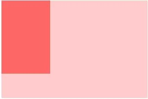
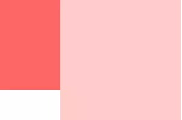
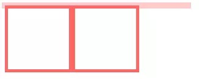
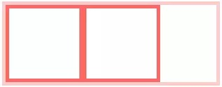
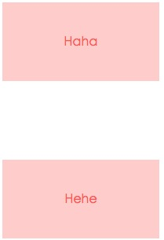
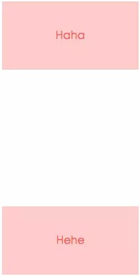

## CSS -- BFC和IFC

@(Interview)

### 前言

在了解`BFC`和`IFC`之前，我们需要先了解一下**Box**和**Formatting Context**的概念

#### Box：CSS布局的基本单位

**Box**是CSS布局的对象和基本单位，直观点来说，就是一个页面有很多个**Box**组成的。元素的类型和`display`属性，决定了这个**Box**的类型。不同类型的**Box**，会参与不同的**Formatting Context(一个决定如何渲染文档的容器)**，因此**Box**内的元素会以不同的方式渲染，比较常见的两种**Box**
- **block-level box: **`display`属性为`block`，`list-item`，`table`的元素，也就是块级元素，会生成`block-level box`，并且参与`block formatting context`，也就是**BFC**
- **inline-level box: **`display`属性为`inline`，`inline-block`，`inline-table`的元素，会生成`inline-level box`，并且参与`inline formatting context`，也就是**IFC**

#### Formatting context

**Formatting context**是`W3C`规范中的一个概念。它是页面中的一块**渲染区域**，并且有一套**渲染规则**，它决定了子元素如何定位，以及和其他元素的关系和相互作用。最常见的**Formatting context**有 **Block formatting context**(简称**BFC**) 和 **Inline formatting context**(简称**IFC**)。CSS3中还增加了`GFC`和`FFC`

**从这两段话我们了解到。所谓的BFC和IFC简单的说就是一块区域，一块渲染的区域，里面的Box根据区域的规则排列**

---

### 一丶BFC

#### 1.关于BFC的定义

BFC直译为**块级格式化上下文**。它是一个**独立渲染区域**，只有**block-level box**参与，它规定了内部的**block-level box**如何布局，并且与这个区域外部毫不相干，不会影响其他区域的布局。

**通俗点解释**：
BFC可以简单的理解为**某个元素的一个CSS属性**，只不过这个属性**不能被开发者显示的修改**，拥有这个属性的元素对内部元素和外部元素会表现出一些特性，这就是BFC

#### 2.触发BFC的条件

满足下列条件之一就可以触发BFC
- 根元素，即`HTML`元素
- `float`的值不为`none` 
- `overflow`的值不为`visible`
- `display`的值为`inline-block`，`flow-root`，`table-cell`，`table-caption`
- `position`的值为`absolute`或`fixed`

#### 3.BFC的布局规则

1. 内部的Box会在垂直方向，一个接一个放置
2. Box垂直方向的距离由margin决定。属于同一个BFC的两个相邻的Box的`margin`会发生重叠
3. 每个元素的左外边缘（`margin-left`）与包含块的左边（`contain box left`）相接触(对于从左往右的格式化，否则相反)。即使存在浮动也是如此。除非这个元素自己形成了一个新的BFC
4. BFC的区域不会与`float`的元素区域重叠
5. 计算BFC的高度时，**浮动子元素**也参与计算
6. BFC就是页面上的一个**隔离的独立容器**，容器里面的子元素不会影响到外面的元素，反之亦然

#### 4.BFC的作用

##### (1).不和浮动元素重叠(两栏布局)

如果一个浮动元素后面跟着一个非浮动元素，那么就会产生一个覆盖的现象

**HTML内容**
```
<div class="main"></div>
<div class="aside"></div>
```
**CSS**
```
		body {
		    width: 300px;
		    display: flow-root;
		    /*position: relative;*/
		}
		.aside {
		    width: 100px;
		    height: 150px;
		    float: left;
		    background: #f66;
		}
		.main {
		    height: 200px;
		    background: #fcc;
		    overflow: hidden;
		}
```
**执行效果**


很明显，`aside`和`main`重叠了，试分析一下，由于两个box都处在同一个BFC中，都是以BFC边界为起点，如果两个box本身都具备BFC的话，会按照顺序一个一个排列布局，现在`main`不具备BFC，根据BFC布局规则第三条
> 每个元素的左外边缘（`margin-left`）与包含块的左边（`contain box left`）相接触(对于从左往右的格式化，否则相反)。即使存在浮动也是如此。除非这个元素自己形成了一个新的BFC

虽然存在浮动的元素`aside`，但是`main`的左边依然会与包含块的左边相接触，根据BFC布局规则第四条

> BFC的区域不会与float box重叠

我们可以通过触发`main`生成BFC，来实现自适应两栏布局，给`main`加上

```
overflow: hidden;
```
**执行结果**


当触发`main`生成BFC后，这个新的BFC不会与浮动的`aside`重叠，因此会根据包含块的宽度，和`aside`的宽度，自动变窄

##### (2).清除元素内部浮动

也就是解决**高度塌陷**的问题

**HTML内容**
```
<div class="par">
	<div class="child"></div>
	<div class="child"></div>
</div>
```
**CSS**
```
	.par {
        border: 5px solid #fcc;
        width: 300px;
    }

    .child {
        border: 5px solid #f66;
        width:100px;
        height: 100px;
        float: left;
    }
```
**执行效果**


根据BFC布局规则第六条:
> 计算BFC的高度时，浮动元素也参与计算

所以为达到清楚内部浮动，我们可以触发`par`生成BFC，那么`par`在计算高度时，`par`内部的浮动元素`child`也会参与计算，给`par`添加
```
overflow: hidden;
```
**执行结果**


高度塌陷的问题解决了~

##### (3).防止垂直`margin`重叠

根据BFC布局规则第二条
> Box垂直方向的距离由`margin`决定。同属于一个BFC的两个相邻Box的`margin`会发生重叠

所以，在同一个BFC中的两个Box会产生上下`margin`重叠的问题，可以通过使其中一个Box成为另一个BFC来解决这个问题

**HTML内容**
```
<p>Haha</p>
<p>Hehe</p>
```
**CSS**
```
	p {
        color: #f55;
        background: #fcc;
        width: 200px;
        line-height: 100px;
        text-align:center;
        margin: 100px;
    }
```
**执行结果**


两个`p`之间明显只有`100px`，说明了`margin`重叠了

然后我们在`p`外层包一层`div`，并形成一个BFC

**HTML内容**
```
<p>Haha</p>
<div class="wrap">
	<p>Hehe</p>
</div>
```
**CSS**
```
	.wrap {
        overflow: hidden;
    }
    p {
        color: #f55;
        background: #fcc;
        width: 200px;
        line-height: 100px;
        text-align:center;
        margin: 100px;
    }
```
**执行结果**


然后我们可以看出来，两个Box之间的`margin`没有重叠，完全分开了。

同样的，对于嵌套元素的`margin`重叠可以同样使用这个方法解决		

##### (4).总结
小小的做一个总结，BFC的作用主要是以下三条
- **清除元素内部浮动(解决高度塌陷问题)**
- **不和浮动元素重叠(两栏布局)**
- **防止`margin`重叠**

---

### 二丶IFC
#### 1. 关于IFC的定义

IFC直译为**内联格式化上下文**，参与IFC的只有`inline-level box`， IFC的**line box(线框)**高度由其包含行内元素中最高的实际高度计算而来

对于IFC来说，**line box**也是一个很重要的角色，**line box**是一个看不见摸不着的边框。同一行`inline-level box`均属于同一个`line box`，也就是说一行`inline-level box`共同创造了一个`line box`

#### 2. 触发IFC的条件

一般只要是行内元素就会形成IFC，比如`<a>`，`<input>`，`<span>`，``，或者设置`display: inline-block`也可以形成IFC

#### 3. IFC的布局规则

1. 框会从包含块的顶部开始，然后一个接一个的排列
2. 在放置这些框的时候，他们在**水平方向上的外边距，边框和内边距所占的空间都会被考虑在内**，然而在**垂直方向上，这些框可能会以不同的方式来对齐，比如他们可以顶部对齐，或者底部对齐也有可能按照文本的基线对齐。**
3. 水平的`padding`,`border`,`margin`有效，竖直方向则无效。不能指定框高。
4. 一般情况下行宽的左边紧贴在他的包含块的左边，同样他的右边也是紧贴在其包含块的右边。但是也不一定，比如出现浮动的话，浮动元素可能会插在包含块和行框之间
5. 计算行框内各个框的高度，对于**非替换元素**就是`line-height`,而对于**替换元素**就是边界框的高度了。

---

### 三丶GFC和FFC
GFC和FFC是H5新添加的两个FC，分别代表了`grid`和`flex`，我们大概介绍一下
#### 1.GFC

GFC直译为**网络布局格式化上下文**。
当一个元素设置`display`值为`grid`的时候，此元素将会获得一个**独立的渲染区域**，我们可以通过在**网格容器**上定义**网格定义行**和**网格定义列**属性各在**网格项目**上定义**网格行**和**网格列**，为每一个**网格项目**定义位置和空间

那GFC有什么用呢，和`table`又有什么区别呢？首先同样是一个二维表格，但`GridLayout`会有更加丰富的属性来控制行列，控制对齐以及更为精细的渲染语义和控制。

#### 2.FFC

FFC直译为**自适应格式化上下文**
当一个元素`display`值为`flex`或者`inline-flex`的元素将会生成**自适应容器**

Flex Box 由伸缩容器和伸缩项目组成。通过设置元素的 `display` 属性为 `flex` 或 `inline-flex` 可以得到一个伸缩容器。设置为 `flex` 的容器被渲染为一个块级元素，而设置为 `inline-flex` 的容器则渲染为一个行内元素。

伸缩容器中的每一个子元素都是一个伸缩项目。伸缩项目可以是任意数量的。伸缩容器外和伸缩项目内的一切元素都不受影响。简单地说，`Flexbox` 定义了伸缩容器内伸缩项目该如何布局。

---

#####参考
- <a href="https://juejin.im/post/5909db2fda2f60005d2093db">https://juejin.im/post/5909db2fda2f60005d2093db</a>
- <a href="https://juejin.im/post/5a4dbe026fb9a0452207ebe6">https://juejin.im/post/5a4dbe026fb9a0452207ebe6</a>
- <a href="https://www.jianshu.com/p/e75f351e11f8">https://www.jianshu.com/p/e75f351e11f8</a>
- <a href="https://blog.csdn.net/weixin_38080573/article/details/79364754">https://blog.csdn.net/weixin_38080573/article/details/79364754</a>
