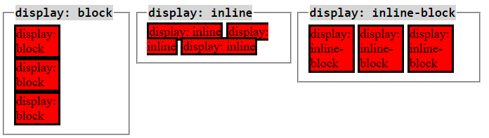
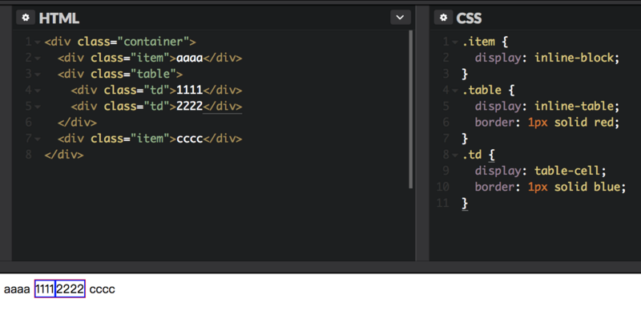

## CSS -- Display

@(Interview)

`display`这个属性是真有意思，之前我认为只有简单的几个取值，今天重新看了一下，着实被吓了一跳，`display`这个属性足足有**32个取值**，太吓人了，不过其中有一大半基本都是用不上的，但作为一个介绍博客，还是把他全说到吧

> **本篇博客的重点是`display`的取值以及一些转换，特殊的一些布局详细使用方法不在讨论之内**

我们将`display`的取值分为6类，还有一个`全局值`总共7类

### 一丶外部值
外部值是什么意思，就是说这些值只会影响一个元素的外部表现，而不影响元素里面的子元素

#### 1.display:block
这个值可以说是很常见了，最基本的块级元素，属于`CSS`入门初学者都知道的概念，只要是容器类的元素基本都是这个值，`<div>`,`<hn>`,`<p>`,`<li>`都是块级元素，他有如下特点
1. 块级元素会**独占一行**，其宽度**自动填满父元素宽度**
2. 可以设置**高度**，**宽度**，各个方向**外补丁**以及各个方向**内补丁**
3. 块级元素中可以容纳其他块级元素或行内元素
4. 若干同级块元素会从上到下一次排列

#### 2.display:inline
这个值也是非常常见，行内元素，只要是行内元素都是这个值，`<span>`,`<a>`,``都是行内元素，特点如下
1. 行内元素**不会独占一整行**，而是只占领自身的宽度和高度的空间
2. 行内元素不可以设置高度，宽度，其高度一般**由其字体的大小**来决定，其宽度由**内容的长度**控制
3. 行内元素只有**左右**的`margin`值和`padding`值产生效果，而上下的`margin`值和`padding`值me
4. 行内元素一般不可以包含块级元素
5. 若干同级行内元素会从左到右，从上到下依次排列 

#### 3.display:run-in
这个值就比较鲜为人知了，因为他的兼容性实在太差，只有`IE`和`Opera`对它支持，那就大概的了解一下吧

**这个声明实现效果是需要条件的：**如果`display:run-in`的box后面跟着一个`display`为`block`水平的box，那么这个应用了`display:run-in`的box将会变成`display:inline`属性，同时内容**嵌入**到后面的`display`为`block`的box中；否则这个display:run-in的box维持其本身的block属。

比较简单的解释：当前元素**跑进(run-in)**后面的元素

兼容性实在太糟糕了，简单了解吧

### 二丶内部值
内部值是什么，根据MDN的解释，内部值主要是用来管束自己的子元素的排列

#### 1.display:flow
这也是个比较奇怪的值，`Chrome`不支持，MDN的解释如下

元素使用流布局列出其内容。
如果它的外部显示类型是`inline`或`run-in`的，并且它正在参与块或内联格式化上下文，则它生成一个内联框。否则，它将生成块容器框。

自己理解一下吧~

#### 2.display:flow-root
这个相对于刚才的`flow`用的人就比较多了，它可以撑起因为`float`造成的高度塌陷问题，换句话说，他是**最新的一种创建BFC的方法**(不了解BFC的，看我博客)

#### 3.display:table
这个属性是用来控制如何把`div`显示成`table`样式，此元素会作为块级表格来显示，表格前后带有换行符。CSS表格能够解决所有那些我们在使用绝对定位和浮动定位进行多列布局时所遇到的问题。使用基于表格的CSS布局，使我们能够轻松定义一个单元格的边界、背景等样式， **而不会产生因为使用了table那样的制表标签所导致的语义化问题。**

利用`table`的特性，我们能够轻易的实现三栏布局，并且能够兼容`IE8`

#### 4.display:flex
这个属性就不用我多说了吧~如今可以说是非常的火，将`flex`布局烂熟于心可以说能解决大部分的布局问题了。
> **注意：设置为Flex布局以后，子元素的float，clear和vertical-align属性将失效**

Flex主要有两大类：**容器属性**和**项目的属性**

**容器属性**
- **flex-direction:** 属性决定主轴的方向（即项目的排列方向）。
- **flex-wrap:** 默认情况下，项目都排在一条线（又称”轴线”）上。flex-wrap属性定义，如果一条轴线排不下，如何换行。
- **flex-flow:** 属性是flex-direction属性和flex-wrap属性的简写形式，默认值为row nowrap。
- **justify-content:** 属性定义了项目在主轴上的对齐方式。
- **align-items:** 属性定义项目在交叉轴上如何对齐。
- **align-content:** 属性定义了多根轴线的对齐方式。如果项目只有一根轴线，该属性不起作用。

**项目属性**
- **order:** 定义项目的排列顺序。数值越小，排列越靠前，默认为0。
- **flex-grow:** 定义项目的放大比例，默认为0，即如果存在剩余空间，也不放大。
- **flex-shrink:** 属性定义了项目的缩小比例，默认为1，即如果空间不足，该项目将缩小。
- **flex-basis:** 属性定义了在分配多余空间之前，项目占据的主轴空间（main size）。浏览器根据这个属性，计算主轴是否有多余空间。它的默认值为auto，即项目的本来大小。
- **flex:** 属性是flex-grow, flex-shrink 和 flex-basis的简写，默认值为0 1 auto。后两个属性可选。
- **align-self:** 属性允许单个项目有与其他项目不一样的对齐方式，可覆盖align-items属性。默认值为auto，表示继承父元素的align-items属性，如果没有父元素，则等同于stretch。

更详细的介绍可以到阮一峰老师的博客中阅读 <a href="http://www.ruanyifeng.com/blog/2015/07/flex-grammar.html">点这里</a>

#### 5.display:grid;
这是一个比较新的布局系统，如果说Flex是简单的一维布局，那Grid可以说是一个二维网格布局的系统，再某些方面，他比Flex更牛逼！

学习`grid`布局有两个重点：一个重点是`grid`布局引入了一个全新的单位：`fr`，它是`fraction`的缩写，所以从此以后，我们又多了一种单位，要想用好`grid`，必须充分掌握`fr`。另一个重点是斜杠操作符，这个斜杠表示的是**起始位置**和**结束位置**。比如说`3/4`，这指的是一个元素从第3行开始，到第4行结束，但又不包括第4行。

如何使用`grid`我们这里不做介绍，有兴趣的看我博客

#### 6.display:ruby
这个的作用方法和`table`比较像，就是将`div`显示成为`<ruby>`，现在一般用在拼音这种地方，它的作用是提供一个**旁注标记**，对于东南亚语言是十分常见的，我们不鼓励使用`ruby属性`，而是应该使用`<ruby>`元素

#### 7.display:subgrid
这可以说是个更加新的值了，2015年8月6日，`W3C`的级联样式单工作组发布了**CSS网格布局模块第一级**的工作草案。在这个草案里规定了上一节我们讲到的`display: grid`的方案。而`display: subgrid`是属于2017年11月9日发布的非正式的**CSS网格布局模块第二级**的内容。所以这是一个非常新的草案，并且围绕它的争议从来也没有断过。

`subgrid`总的思想是说大网格里还可以套小网格，互相不影响。但如果`grid`里可以再套`subgrid`的话，那我`subgrid`里还想再套`subgrid`怎么办？况且，到底是`grid: subgrid`还是`display: subgrid`这个也没有达成共识

总之，这个肯定是用不上了，再等几年吧

### 三丶列表值

#### 1.display:list-item
`display: list-item`和`displya: table`一样，也是通过`CSS`将`HTML`的一些标签表示出来，如果要完全模仿列表的话还需要加上`list-style-position`，`list-style-type`，这样就和列表`<ul>`，`<li>`所表示出来的东西完全一样了，我是搞不懂为什么要弄个这出来

列表值就这一个

### 四丶属性值

属性值一般是附属于主值，比如主值里设置了`display: table`，就可以在子元素里使用`display: table-row-group`等等属性，不过并不是绝对的，关于他们的作用，一般是需要配合主值来使用，没什么特殊的用法

#### 1.display:table的附属属性值

| table    |  对应于HTML元素中的`<table>`。定义了一个块级框 |
| :--------:|:--------:|
| **table-header-group** | 对应于HTML元素中的`<thead>` |
| **table-row** | 对应于HTML元素中的`<tr>` |
| **table-cell** | 对应于HTML元素中的`<td>` |
| **table-row-group** | 对应于HTML元素中的`<tbody>` |
| **table-footer-group** | 对应于HTML元素中的`<tfoot>` |
| **table-column-group** | 对应于HTML元素中的`<colgroup>` |
| **table-column** | 对应于HTML元素中的`<col>` |
| **table-caption** | 对应于HTML元素中的`<caption>` |


#### 2.display:ruby的附属属性值

| ruby    | 对应于HTML元素中的`<ruby>`，它将生成一个ruby容器框,产生一个`ruby`格式上下文用于标记为内部`ruby`框的子元素 |
| :--------:|:--------:|
| **ruby-base** | 对应于HTML元素中的`<rb>` |
| **ruby-text** | 对应于HTML元素中的`<rt>` |
| **ruby-base-container** | 对应于HTML元素中的`<rbc>` |
| **ruby-text-container** | 对应于HTML元素中的`<rtc>` |

### 五丶显示值

#### 1.display:contents
我们给出官方的解释如下
> 元素本身不能生成任何盒模型，但是它的子元素或者伪元素可以正常生成。为了盒模型的生成与布局，该元素就好像在Dom树中被子元素与伪元素所替代一样

简单来说，如果我们设置了这个属性，那么当前元素会消失，即使你打开开发者工具，也找不到它，就好像设置了`display:none`一样。但是它的子元素还依旧存在，甚至，它的一些可继承属性，它的子元素可以拿到。我们来看一个例子

**HTML内容**
```
<div class="contents">
	<div>
		sssss
	</div>
</div>
```
**CSS**
```
.contents {
	width: 200px;
	height: 50px;
	color: blue;
	text-align: center;
	font-size: 20px;
	border: 1px solid black;
	background-color: red;
}
```
**执行结果**


然后我们给`contents`添加上`display:contents`

**CSS**
```
.contents {
	width: 200px;
	height: 50px;
	color: blue;
	text-align: center;
	font-size: 20px;
	border: 1px solid black;
	background-color: red;
	display: contents;
}
```
**执行结果**


可以看出来，`contents`消失不见了，它的`width`,`height`,`border`,`background-color`属性全部没有，而它的子元素`div`继承的`color`,`font-size`,`text-align`却都在

#### 2.display:none

这个不需要多说什么，相当于直接把这个元素干掉，将元素设置为`none`的时候既不会占据空间，也无法显示，相当于该元素不存在

### 六丶混合值

混合值是比较好理解了，大白话就是将两种`display`组合在一起使用

#### 1.display:inline-block

这个属性也不陌生，字面就可以理解，**`inline-block`既具有block的宽高特性又具有inline的同行元素特性**，这个不想多说，实在太熟悉了，一张图告诉你

> **注意：值得注意的是`inline-block`会造成幽灵空白的问题，这是因为我们平时写`HTML`时换行留下的空白造成的，可以通过将`font-size`设置为`0`来解决该问题**

#### 2.display:inline-table

同样的，这个属性表示在行内显示一个表格，很容易理解，就像这样


#### 3.display:inline-flex

表示将元素作为内联块级弹性伸缩盒显示，在行内进行弹性布局

#### 4.display:inline-grid

在行内进行网格布局

### 七丶全局值

还有三个是所有元素都会有的三个值：**inherit**，**initial**，**unset**

- **inherit：**继承父元素的`display`
- **initial：**不论父元素如何设置都不会继承，恢复为浏览器最初始设置的`display`属性
- **unset：**`unset`混合了`inherit`和`initial`。如果父元素设值了，就用父元素的设定，如果父元素没设值，就用浏览器的初始设定

到目前，32个`display`全部介绍完毕，融会贯通最重要

---

##### 参考：
- <a href="https://juejin.im/entry/5a5b26d8f265da3e56617d54">https://juejin.im/entry/5a5b26d8f265da3e56617d54</a>
- <a href="https://juejin.im/entry/587c46cc1b69e6006bf1e715">https://juejin.im/entry/587c46cc1b69e6006bf1e715</a>
- <a href="https://www.cnblogs.com/zhuzhenwei918/p/6058457.html">https://www.cnblogs.com/zhuzhenwei918/p/6058457.html</a>
- <a href="https://www.w3cplus.com/css/how-well-do-you-know-display.html">https://www.w3cplus.com/css/how-well-do-you-know-display.html</a>
- <a href="https://developer.mozilla.org/zh-CN/docs/Web/CSS/display">https://developer.mozilla.org/zh-CN/docs/Web/CSS/display</a>
- <a href="https://www.zhangxinxu.com/wordpress/2012/03/tip-css-multiline-display/">https://www.zhangxinxu.com/wordpress/2012/03/tip-css-multiline-display/</a>