## CSS -- Flex

@(Interview)

### 前言

本博客基本是完全借鉴阮一峰老师的博客，目的是自己熟悉一遍 `Flex` 的使用

#### `Flex`的背景以及兼容性

`Flexbox` 布局（也叫 `Flex` 布局，弹性盒子布局）模块目标在于提供一个更有效地布局、对齐方式，并且能够使**父元素在子元素的大小未知或动态变化情况下仍然能够分配好子元素之间的间隙**。

`Flex` 布局的主要思想是使父元素能够调节子元素的**高度**、**宽度**和**排布的顺序**，从而能够最好地适应可用布局空间（能够适应不同的设备和不同大小的屏幕）。**设定为 `flex` 布局的父元素（容器）能够放大子元素使之尽可能填充可用空间，也可以收缩子元素使之不溢出**。

最重要的是，与传统布局中块状元素按照垂直方向摆放，行内元素按照水平方向摆放相比，**`flex` 布局是无方向的**。传统布局在应对大型复杂的布局时缺乏灵活性，特别是在改变方向、改变大小、伸展、收缩等等方面。


#### `Flex` 会触发FFC

`FFC(Flex Formatting Contexts)` 直译为"自适应格式化上下文"，`display` 值为 `flex` 或者 `inline-flex` 的元素将会生成自适应容器（`flex container`）

`Flex Box` 由伸缩容器和伸缩项目组成。通过设置元素的 `display` 属性为 `flex` 或 `inline-flex` 可以得到一个伸缩容器。设置为 `flex` 的容器被渲染为一个块级元素，而设置为 `inline-flex` 的容器则渲染为一个行内元素。

伸缩容器中的每一个子元素都是一个伸缩项目。伸缩项目可以是任意数量的。伸缩容器外和伸缩项目内的一切元素都不受影响。简单地说，`Flexbox` 定义了伸缩容器内伸缩项目该如何布局。

#### `Flex` 布局是什么

`Flex` 是 `Flexible Box` 的缩写，意为"弹性布局"，用来为盒状模型提供最大的灵活性。

任何一个容器都可以指定为 `Flex` 布局

只需要这样
```css
.box {
	display: flex
}
```

行内元素也可以使用 `Flex` 布局

```css
.box {
	display: inline-flex
}
```

`Webkit` 内核的浏览器，必须加上 `-webkit` 前缀

```css
.box{
  display: -webkit-flex; /* Safari */
  display: flex;
}
```

**注意：设置为 `Flex` 布局以后，子元素的 `float`，`clear`，`vertical-align`都将失效**


### 一丶基本概念

采用 `Flex` 布局的元素，称为 `Flex` 容器（flex container），简称"容器"。它的所有子元素自动成为容器成员，称为 `Flex` 项目（flex item），简称"项目"

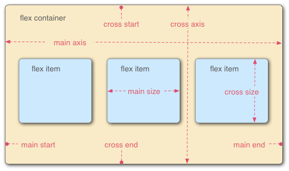


容器默认存在两根轴：**水平的主轴**（main axis）和 **垂直的交叉轴**（cross axis）。主轴的开始位置（与边框的交叉点）叫做 `main start`，结束位置叫做 `main end`；交叉轴的开始位置叫做`cross start`，结束位置叫做 `cross end`。

**项目默认沿主轴排列**。单个项目占据的主轴空间叫做 `main size`，占据的交叉轴空间叫做 `cross size`。

### 二丶容器属性

容器属性有 6 个

- `flex-direction`
- `flex-wrap`
- `flex-flow`
- `justify-content`
- `align-items`
- `align-content`

#### 1. flex-direction 属性

`flex-direction`属性决定了主轴的方向（即项目的排列方向）

他有四个值

- `row`(默认值)：主轴为水平方向，起点在左端
- `row-reverse`：主轴为水平方向，起点在右端。
- `column`：主轴为垂直方向，起点在上沿。
-  `column-reverse`：主轴为垂直方向，起点在下沿。

注意，项目是紧贴着父元素的边排列的

#### 2. flex-wrap 属性

默认情况下，项目都排在一条线（又称"轴线"）上。`flex-wrap` 属性定义，如果一条轴线排不下，如何换行。

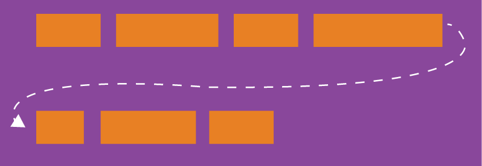

这个属性有三个值
- `nowrap`(默认)：不换行
- `wrap`：换行
- `wrap-reverse`：换行，第一行在下方

三个值的效果图分别如下

`nowrap`

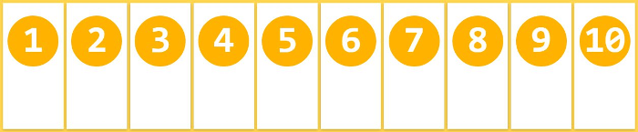

`wrap`

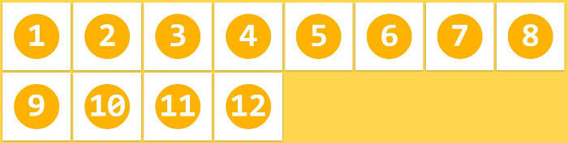

`wrap-reverse`

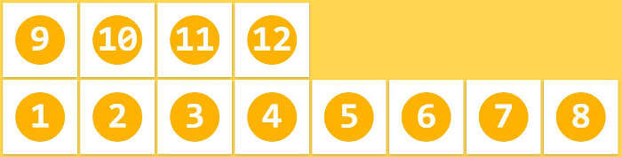

#### 3. flex-flow 属性

`flex-flow` 是 `flex-direction` 属性和 `flex-wrap` 属性的简写形式，默认值为 `row nowrap`

```css
.box {
  flex-flow: <flex-direction> || <flex-wrap>;
}
```

#### 4. justify-content 属性

`justify-content` 属性定义了项目在**主轴上**的对齐方式。

这个属性可以取 6 个值

- `flex-start`(默认值)：主轴的起点对齐
- `flex-end`：主轴的终点对齐
- `center`：居中
- `space-between`：两端对齐，项目之间的间隔都相等
- `space-around`：每个项目两侧的间隔相等。所以，项目之间的间隔比项目与边框的间隔大一倍
- `space-evenly`：venly是匀称、平等的意思。也就是视觉上，**每个flex子项两侧空白间距完全相等**

效果如下

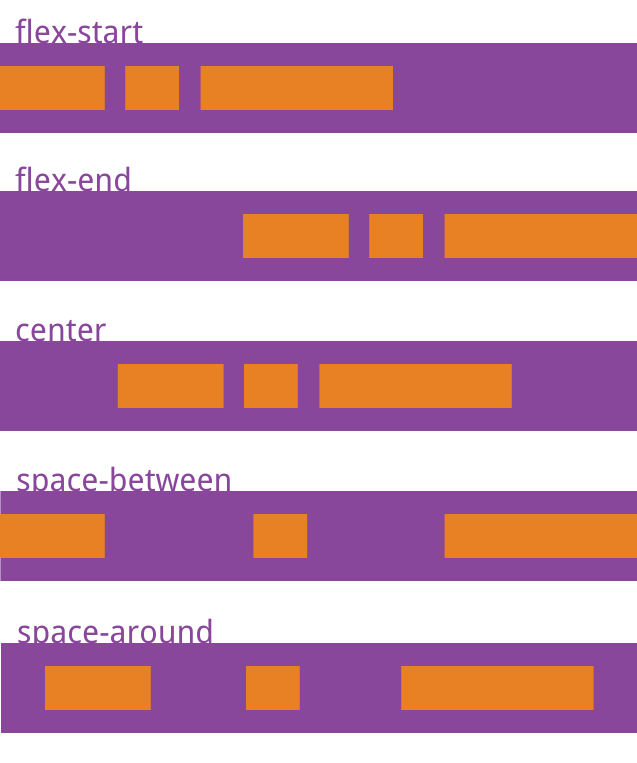

#### 5. align-items 属性

`align-items` 属性定义项目在**交叉轴上**如何对齐。

这个属性右 5 个值

- `flex-start`：交叉轴的起点对齐
- `flex-end`：交叉轴的终点对齐
- `center`：交叉轴的中点对齐
- `baseline`：项目的第一行文字的基线对齐
- `stretch`(默认值)：如果项目未设置高度或设为 `auto`，将占满整个容器的高度。

效果如下：

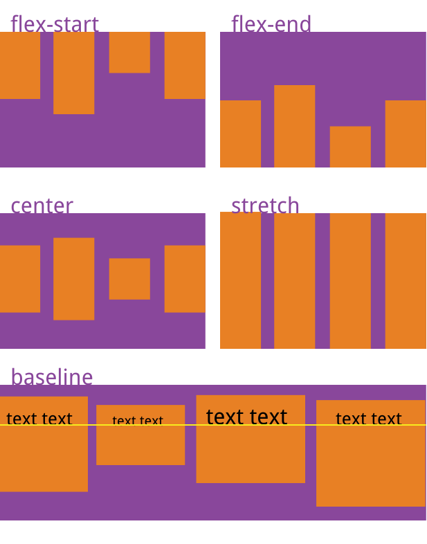

#### 6. align-content 属性

`align-content` 属性定义了**多根轴线的对齐方式**。如果项目只有一根轴线，该属性不起作用。

该属性有 7 个值

- `flex-start`：与交叉轴的起点对齐。
- `flex-end`：与交叉轴的终点对齐。
- `center`：与交叉轴的中点对齐。
- `space-between`：与交叉轴两端对齐，轴线之间的间隔平均分布。
- `space-around`：每根轴线两侧的间隔都相等。所以，轴线之间的间隔比轴线与边框的间隔大一倍
- `space-evenly`：每一行元素都完全上下等分
- `stretch`(默认值)：轴线占满整个交叉轴

### 三丶项目属性

以下6个属性设置在项目上。

- `order`
- `flex-grow`
- `flex-shrink`
- `flex-basis`
- `flex`
- `align-self`

#### 1. order属性

`order` 属性定义项目的排列顺序。数值越小，排列越靠前，**默认为 0**。

```css
.item {
  order: <integer>;
}
```

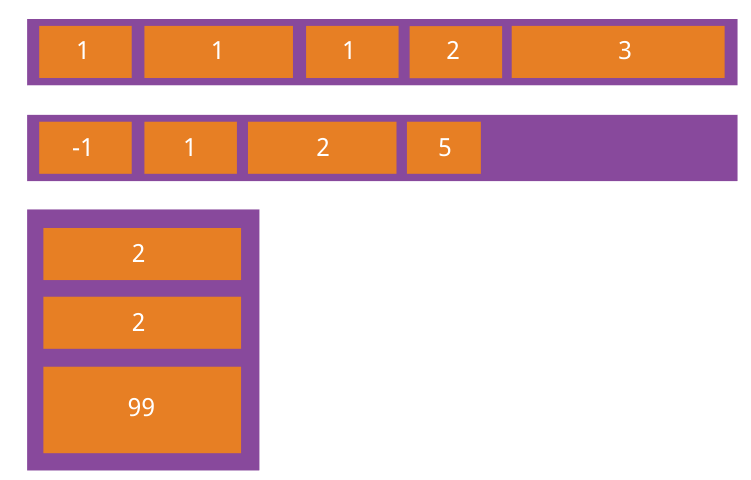

#### 2. flex-grow 属性

`flex-grow` 属性定义项目的放大比例，默认为 0。

**该属性的前提条件是父元素有多余空间**，也就是父元素的宽度会比所有项目的宽度加起来还要大才会生效

如果我们给其中一个项目设置了`flex-grow: 1`其他项目没有设置，那设置了的项目会将父元素充满，其他项目宽度保持不变

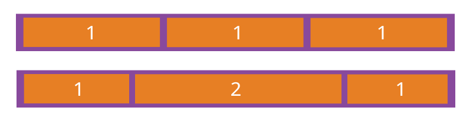

如果所有项目的 `flex-grow` 属性都为 1，则它们将等分**剩余空间**（如果有的话）。如果一个项目的 `flex-grow` 属性为 2，其他项目都为 1，则前者占据的**剩余空间**将比其他项多一倍。

注意：
- **分配的是剩余空间**
- **负值对该属性无效**

这个属性我们自己动手实践一下

HTML
```htmlbars
	<div id="box">
		<div id="box1" class="boxs">box1</div>
		<div id="box2" class="boxs">box2</div>
		<div id="box3" class="boxs">box3</div>
	</div>
```

CSS
```css
		#box {
			border: 5px solid black;
			height: 100px;
			width: 600px;
			display: flex;
		}
		#box1 {
			background-color: blue
		}
		#box2 {
			background-color: red;
		}
		#box3 {
			background-color: green;
		}
		.boxs {
			width: 100px;
			height: 100px;
		}
```
现在是这样的

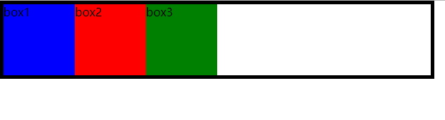

可以看到，父元素是有剩余空间的，然后我们给第一个项目设置 `flex-grow: 1`

```css
		#box1 {
			flex-grow: 1;
			background-color: blue
		}
```

然后就变成了这样

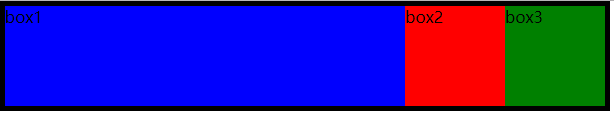

设置了`flex-grow`的项目充满了整个空间。

如果说父元素的宽度没有剩余空间了，那设置什么都是白搭，比如这样

```css
		#box {
			border: 5px solid black;
			height: 100px;
			width: 200px;
			display: flex;
		}
		#box1 {
			flex-grow: 1;
			background-color: blue
		}
		#box2 {
			flex-grow: 2;
			background-color: red;
		}
		#box3 {
			flex-grow: 1;
			background-color: green;
		}
		.boxs {
			width: 100px;
			height: 100px;
		}
```

结果是这样

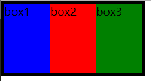

丝毫没有变化。

那如果使用 `flex-wrap` 产生换行，结果会是什么样的呢

```css
		#box {
			border: 5px solid black;
			width: 200px;
			display: flex;
			flex-wrap: wrap
		}
		#box1 {
			background-color: blue
		}
		#box2 {
			background-color: red;
		}
		#box3 {
			flex-grow: 1;
			background-color: green;
		}
		.boxs {
			width: 100px;
			height: 100px;
		}
```

换行后，给第三个项目添加 `flex-grow: 1`，这时候是这样

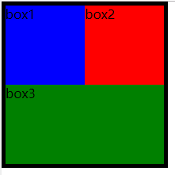

可以看到，第三个项目又将主轴填充满了，因为第二行有剩余空间

这里还有一个有意思的事情，我们以 1 为界限，来分一下情况

##### 只有一个元素设置了`flex-grow`
- `flex-grow`大于 1 的时候，会将剩余空间全部拿走
- `flex-grow`小于 1 的时候，会拿走 (剩余空间 * `flex-grow`) 的大小

##### 多个元素设置了`flex-grow`
- `flex-grow`值总和小于 1，则先拿走 (剩余空间 * `flex-grow`) 的大小，然后按比例分配给每个设置了`flex-grow`的子项
- `flex-grow`值总和大于 1，则拿走全部剩余空间，然后按比例分配给每个设置了 `flex-grow` 的子项


#### 3. flex-shrink 属性

`flex-shrink` 属性定义了项目的缩小比例，默认为 1。**即如果空间不足，该项目将缩小**。 

**该属性的前提条件和`flex-grow`刚好相反，这个是空间不足才会触发**

```css
.item {
  flex-shrink: <number>; /* default 1 */
}
```

如果所有项目的 `flex-shrink` 属性都为1，当空间不足时，都将**等比例缩小**。如果一个项目的 `flex-shrink` 属性为 0，其他项目都为 1，则空间不足时，**前者不缩小**。

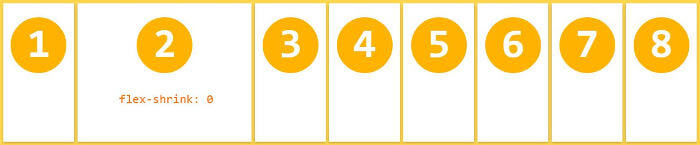

注意：

**负值对该属性无效**

#### 4. flex-basis 属性

`flex-basis` 属性定义了在分配多余空间之前，项目占据的主轴空间（main size）。浏览器根据这个属性，计算主轴是否有多余空间。它的默认值为 `auto` ，即项目的本来大小。

```css
.item {
  flex-basis: <length> | auto; /* default auto */
}
```

如果同时设置了 `width` 和 `flex-basis`，会忽略 `width`

**注意：当剩余空间不足的时候，`flex`子项的实际宽度并通常不是设置的 `flex-basis` 尺寸，因为 `flex` 布局剩余空间不足的时候默认会收缩。**

#### 5. flex 属性

`flex` 属性是 `flex-grow`, `flex-shrink` 和 `flex-basis` 的简写，默认值为 0 1 auto。后两个属性可选。

```
.item {
  flex: none | [ <'flex-grow'> <'flex-shrink'>? || <'flex-basis'> ]
}
```

该属性有两个快捷值：`auto` (1 1 auto) 和 `none` (0 0 auto)。

建议优先使用这个属性，而不是单独写三个分离的属性，因为浏览器会推算相关值。


#### 6. align-self 属性

`align-self` 属性允许**单个项目有与其他项目不一样的对齐方式**，可覆盖 `align-items` 属性。默认值为 `auto`，表示继承父元素的 `align-items` 属性，如果没有父元素，则等同于`stretch`。

```css
.item {
  align-self: auto | flex-start | flex-end | center | baseline | stretch;
}
```

这些属性和 `align-items`效果一样，除了 `auto`，`auto`就是`align-items`的布局方式

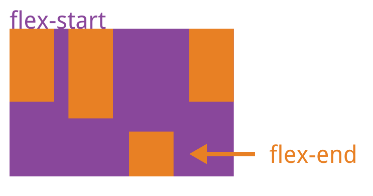

