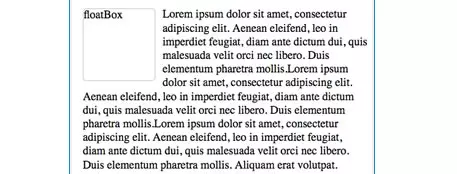
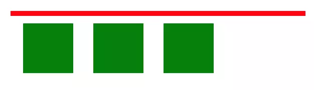
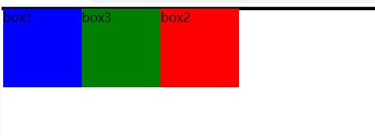
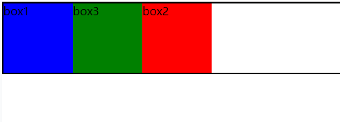

## CSS -- 浮动

@(Interview)

浮动是一个我们经常会用到的属性

### 一丶浮动简介

#### 1. 什么是浮动
浮动核心就一句话：**浮动元素会脱离正常流并向左/向右浮动，直到碰到父元素或者另一个浮动元素**。

其实浮动最初设计的目的是为了实现**文字环绕**效果，如下



但是早期的前端开发者发现：浮动的元素可以设置宽高并且可以内联排列，是介于 `inline` 和 `block` 之间的一个神奇的存在，在 `inline-block` 出来之前，浮动大行其道。直到 `inline-block` 出来后，浮动也有它自己独特的使用场景。

浮动的值如下

- `left`：表明元素必须浮动在其所在的块容器左侧的关键字
- `right`：表明元素必须浮动在其所在的块容器右侧的关键字
- `none`：表明元素不进行浮动的关键字
- `inline-start`：表明元素必须浮动在其所在块容器的开始一侧，在ltr脚本中是左侧，在rtl脚本中是右侧
- `inline-end`：表明元素必须浮动在其所在块容器的结束一侧，在ltr脚本中是右侧，在rtl脚本中是左侧。

**注意：**后两个元素值还在实验中，不适合


#### 2. 浮动的特点

1. 浮动元素会脱离正常流，也就是说浮动不会影响普通元素的布局
2. 浮动元素会使文字环绕，即使是别的元素中的文字
2. 浮动可以内联排列，**因为浮动会向左或向右浮动，直到碰到另一个浮动元素为止**
3. 浮动元素会导致父元素高度坍塌

其他的还好说，父元素高度塌陷是个大问题，必须得解决一下。

怎么解决？清除浮动！

### 二丶清除浮动

在我们使用浮动的时候，会出现这样一个问题，如下



明显，浮动使父元素的高度塌陷，我们需要解决这个问题，右好几种方式，我们分别介绍一下

#### 1. clear

`clear`属性是不允许**被清除浮动的元素**左边/右边挨着浮动元素。他有以下值：

| 属性值 | 效果 |
| ------- | ------------------------------------- |
| left    | 在左侧不允许浮动元素。                |
| right   | 在右侧不允许浮动元素。                |
| both    | 在左右两侧均不允许浮动元素。          |
| none    | 默认值。允许浮动元素出现在两侧。      |

它的原理如下：

- 在 `CSS1` 和 `CSS2` 中，这是通过自动为清除元素（即设置了 clear 属性的元素）增加**上外边距实现的**
- 在 `CSS2.1` 中，会在清除元素上**外边距之上增加清除空间**，而外边距本身并不改变。

这两种方法，最终的结果都一样，这里有一个地方需要注意一下：

- 如果声明为左边或右边清除，会使元素的上外边框边界刚好在**该边**上浮动元素的下外边距边界之下，如果是`clear`的值`both`，那么会在**高度较大**的浮动元素下显示

现在我们的目的是通过`clear`解决父元素高度塌陷的问题，有两种解决办法

##### 第一种：clear + div

直接上代码，先看一下浮动后的情况

HTML
```htmlbars
	<div id="box">
		<div id="box1" class="boxs">box1</div>
		<div id="box3" class="boxs">box3</div>
		<div id="box2" class="boxs">box2</div>
	</div>
```

CSS
```css
		#box {
			border: 2px solid black;
		}
		#box1 {
			background-color: blue
		}
		#box2 {
			background-color: red;
		}
		#box3 {
			background-color: green;
		}
		.boxs {
			float: left;
			width: 100px;
			height: 100px;
		}
```
出来的结果是这样的



现在我们要解决高度塌陷的问题了

首先在在BOX下添加一个 `<div>`

HTML
```
	<div id="box">
		<div id="box1" class="boxs">box1</div>
		<div id="box3" class="boxs">box3</div>
		<div id="box2" class="boxs">box2</div>
		<div id="clear"></div>
	</div>
```

然后我们给这个`<div>`添加一个`clear`属性

```css
#clear {
	clear: both;
}
```
然后结果就是这样的了



父元素高度成功撑开。

因为我们给 `<div clear>`添加了 `clear: both`，所以`<div clear>`在上方添加了清除空间，

这种方法虽然简单，但是不建议使用，因为会添加一个没有用的标签，对于后期的维护很不方便

**优点：简单，代码少，浏览器兼容性好。**
**缺点：需要添加大量无语义的html元素，代码不够优雅，后期不容易维护。**

这种方法可以完美被下一种方法替换

##### 第二种：clear + ::after

我们都用过伪元素，所以完全可以在伪元素上添加`clear: both`，具体实现如下

同样的代码，把那个`<div>`去掉就好了，在CSS种这样设置

```css
#box::after {
	display: block;
	content: '';
	clear: both;
}
```
我们利用伪元素，在父盒子后添加了一个元素，然后给他设置 `clear: box`，可以达到同样的效果，还不会有没用的标签出现

需要注意的是为了兼容IE6和IE7浏览器，要给`box`添加一条`zoom:1`来触发`haslayout`。简单介绍一下这是个什么东西

`haslayout` 是IE7-浏览器的特有属性。`hasLayout` 是一种只读属性，有两种状态：`true` 或`false`。当其为 `true` 时，代表该元素有自己的布局，否则代表该元素的布局继承于父元素。


**优点：简单，不会有额外的标签。**
**缺点：对于兼容性不是很好。**


#### 2. BFC

除了使用 `clear` 还可以使用 BFC 来清除浮动，BFC的详细介绍在我另一篇博客里，欢迎大家学习交流

BFC可以解决高度塌陷的原理就一句话：**计算BFC的高度，浮动元素也会参与计算**

触发BFC的方式有很多，我们推荐使用 `display: flow-root`

这是一个专门用来触发 BFC 的属性，不会产生副作用。但是因为比较新，所以兼容性可能不是很好

### 三丶浮动的应用场景

浮动一般用来**多列布局**，不过现在有了 `flex` ，浮动也用的不太多了。

还有一个用途就是创建浮动的原本想法，使**文字环绕**


### 四丶一些有意思的东西

如果 在一个元素上同时使用 `flex` 和 `position`会发生什么呢

经实验：
- 如果是`position: absolute` 和 `position: fixed`，那`float`会失效
- 如果是`position: relative` 和 `position: sticky`，那么`flaot`不会失效

父元素如果设置了 `display: flex` 也会使 `float` 失效


---

##### 参考：
- <a href="https://juejin.im/entry/580479b85bbb50005b7c5083">https://juejin.im/entry/580479b85bbb50005b7c5083</a>
- <a href="https://www.cnblogs.com/xiaohuochai/p/4845314.html">https://www.cnblogs.com/xiaohuochai/p/4845314.html</a>

---