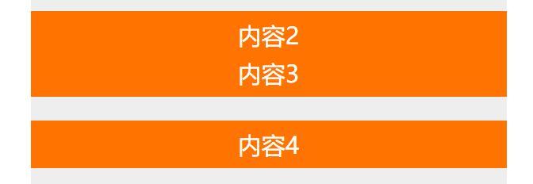

## CSS -- Position

@(Interview)

### 一丶Position简介
在CSS中，position是我们用的比较多的一个属性，很多效果的实现都需要借助position，今天总结了一下position知识点与常用功能，和大家分享一下
#### 1.position的取值
position有五个值可选
- **absolute：**生成绝对定位的元素，对象**脱离**正常文档流，相对于除了`static`定位以外的**第一个父元素**进行定位，元素的位置通过`left`,`top`,`right`,`bottom`属性进行规定，元素的层叠通过`z-index`属性进行规定
- **relative：**生成相对定位的元素，对象**遵循**正常文档流，相对于其**正常位置**进行定位，元素的位置将依据`left`,`top`,`right`,`bottom`等属性在正常文档流中偏移位置。也就是说，`right: 20`会向元素的`right`位置添加 20 像素
- **fixed：**生成绝对定位的元素，对象**脱离**正常文档流，如果父元素的`transform`为`none`，则相对于**浏览器窗口**进行定位，否则相对于**父元素**定位，元素的位置通过`left`,`top`,`right`,`bottom`属性进行规定。当出现滚动条时，对象不会随着滚动。
- **static：**默认值，没有定位，对象**遵循**正常文档流，元素出现在正常的流中（忽略 top, bottom, left, right 或者 z-index 声明）
- **sticky：**一个比较新的定位方式，且还处于实验性的取值，**粘性定位**。可以说它是结合了`relative`和`fixed`两种定位功能于一体的特殊定位，元素先按照**普通文档流**定位，而后，元素定位表现为在跨越特定**阈值**之前为相对定位，之后为固定定位，也就是`fixed`。这个特定阈值指的是`left`,`top`,`right`,`bottom`之一，换言之，指定`left`,`top`,`right`,`bottom`四个阈值其中之一，才可使粘性定位生效，否则其行为与相对定位相同

除了这四个，还有一个`inherit`，规定从父元素继承`position`属性的值，没有什么特别的

> **注意：**在`absolute`，`relative`，`sticky`，`fixed`这几种定位中，如果同时设置了`top`和`bottom`，则`top`的优先级高，如果同时设置了`left`和`right`，则`left`的优先级高

### 二丶详细介绍
#### 1.相对定位(relative)

相对定位的元素是在文档中的正常位置偏移给定的值，但是不影响其他元素的偏移，由相对定位所造成的空白会留下
**HTML内容**
```
<div class="box" id="one">One</div>
<div class="box" id="two">Two</div>
<div class="box" id="three">Three</div>
<div class="box" id="four">Four</div>
```
**CSS**
```

.box {
  display: inline-block;
  width: 100px;
  height: 100px;
  background: red;
  color: white;
}

#two {
  position: relative;
  top: 20px;
  left: 20px;
  background: blue;
}
```
**执行结果**


从结果可以看出，Two原来位置的空白会留下，且不会对其他元素的布局造成影响

#### 2.绝对定位(absolute)
绝对定位的元素脱离了文档流。在布置文档流中其它元素时，绝对定位元素不占据空间，也就是说由绝对定位造成的空白会被后面的元素顶上，定位的参考元素是距离最近的position不为static的父元素
**HTML内容**
```
<div class="box" id="one">One</div>
<div class="box" id="two">Two</div>
<div class="box" id="three">Three</div>
<div class="box" id="four">Four</div>
```
**CSS**
```
.box { 
   display: inline-block; 
   background: red; 
   width: 100px; 
   height: 100px; 
   float: left; 
   margin: 20px; 
   color: white; 
}

#three { 
   position: absolute; 
   top: 20px; 
   left: 20px; 
}
```
**执行结果**


Three基于父元素定位，距离顶部和左边各`20px`，Three元素原来的位置由Four元素顶上，对其他元素的布局会有影响，而**相对于父元素**这个点却不明显，再看个例子

**HTML内容**
```
<div class="con1">
	<div class="con2">
		<div class="con3">
			<div class="box" id="one">One</div>
			<div class="box" id="two">Two</div>
			<div class="box" id="three">Three</div>
			<div class="box" id="four">Four</div>
		</div>
	</div>
</div>
```
**CSS**
```
.con1 {
	padding: 40px;
	box-sizing: border-box;
	background-color: black;
}
.con2 {
	padding: 40px;
	box-sizing: border-box;
	background-color: blue;
	position: relative;
}
.con3 {
	padding: 40px;
	box-sizing: border-box;
	background-color: green;
}
.box { 
	 display: inline-block; 
	 background: red; 
	 width: 100px; 
	 height: 100px; 
	 margin: 20px; 
	color: white; 
}
#three { 
	position: absolute; 
	top: 0; 
	left: 0;
}
```
**执行结果**


上面这段代码可以看出，Three的位置是基于`con2`定位的，因为`con3`的`position`为`static`，所以会继续向上寻找，直到找到了`con2`，`position`为`relative`，所以就基于这个父元素定位

#### 3.固定定位(fixed)
固定定位的元素脱离了文档流。固定定位与绝对定位相似，但元素的包含块为 viewport 视口，就是浏览器窗口。**而且由于`transform`，导致如果父元素的`transform`不为`none`，则相对于父元素定位，否则相对于浏览器窗口定位。**该定位方式常用于创建在滚动屏幕时仍固定在相同位置的元素。

**HTML内容**
```
<div class="box"></div>
<div class="box1 box2"></div>
<div class="box1 box3"></div>
<div class="box1 box4"></div>
<div class="box1 box5"></div>
<div class="box1 box6"></div>
```
**CSS**
```
.box {
		width: 100px;
		height: 100px;
		position: fixed;
		background-color: black;
	}
	.box1 {
		margin-left: 140px;
		height: 500px;
		width: 500px;
	}
	.box2 {
		background-color: red;
	}
	.box3 {
		background-color: green;
	}
	.box4 {
		background-color: blue;
	}
	.box5 {
		background-color: black;
	}
	.box6 {
		background-color: yellow;
	}
```
**执行结果**


左边的黑色方块是基于浏览器定位的，所以不论如何移动滚动条，黑色方块的位置相对于浏览器窗口是不会移动的。

#### 4.粘性布局(sticky)

粘性布局可以认为是相对定位和固定定位的混合。元素在跨越特定阈值前为相对定位，之后为固定定位。这样说可能比较难以理解，我们还是看个例子
**HTML内容**
```
<div class="parent">
	<div class="children">
		内容1
	</div>
	<div class="children">
		内容2
	</div>
	<div class="children">
		内容3
	</div>
	<div class="children">
		内容4
	</div>
	<div class="childrenx"></div>
</div>
```
**CSS**
```
.parent {
	background: #eee;
	width: 600px;
	padding-top: 200px;
	height: 10000px;
	margin: 0 auto;
}
.children {
	position: -webkit-sticky;
	position: sticky;
	height: 60px;
	margin-bottom: 30px;
	background: #ff7300;
	top: 40px;
}
.childrenx {
	height: 600px;
	background-color: black;
}
div {
	font-size: 30px;
	text-align: center;
	color: #fff;
	line-height: 60px;
}
```
我们给`children`设置粘性定位，并且将`top`值设置为`40px`，阈值就为`40px`，一开始布局是这样


可以看出来，`children`并没有特别的布局，就是按照文档流排列，也就是相对定位，当我们将页面向下滚动后




可以看到，因为`top`值设置为40，所以`children`在与浏览器顶端的距离小于40后，就会固定在顶部，就像是固定定位一样，不会再移动，除非`children`与浏览器的距离再次大于40才会再恢复到相对定位，这就是神奇的粘性定位，粘性定位还有很多要注意的地方

1. 必须指定`left`,`top`,`right`,`bottom`四个阈值其中之一，才可使粘性定位生效。否则其行为与相对定位相同。**其中，如果`top`和`bottom`同时设置时，`top` 生效的优先级高，`left`和`right`同时设置时，`left`的优先级高**
2. 设定为`position:sticky`元素的任意父节点的`overflow`属性不能是`hidden`或者`auto`，否则`position:sticky`不会生效，原因很简答，**如果父容器无法进行滚动，那元素就永远不可能超过阈值，也就不会生成固定的效果**
3. 如果 `position:sticky` 元素的任意父节点定位设置为 `position:relative | absolute | fixed`，则元素相对父元素进行定位，而不会相对浏览器窗口定位，这一点跟`absolute`很像，会向上找寻第一个**`position`不为`static`**的父元素，并基于此定位。（有待商榷）

> 介于这是一个比较新的定位，浏览器的支持还不是很理想，所以可以再观望一阵

### 三丶日常使用
介绍了这么多定位，在什么地方使用比较合适呢
#### 1. 绝对定位和相对定位
绝对定位和相对定位可以说是使用最频繁的一对定位了，很多布局都得借助这两种定位
1. 垂直水平居中
2. 给元素添加动画的时候，一般都需要脱离文档流，以防止对其他元素的影响
3. 将一个元素覆盖到另一个元素上时

#### 2.固定定位
这个一般用在浮动的窗口和菜单
1. 浮动菜单
2. 吸顶菜单
3. 一些需要在页面固定显示的元素

#### 3.粘性定位
粘性定位有一个很典型的用处，就是定位字母列表的头部元素，或者一些需要滚动的头部元素，这种布局一般是用JS实现，粘性布局可以更好的实现，但是现在不太建议使用这个定位，因为**兼容性比较差**

---

##### 参考：
- <a href="https://developer.mozilla.org/zh-CN/docs/Web/CSS/position">https://developer.mozilla.org/zh-CN/docs/Web/CSS/position</a>
- <a href="https://www.cnblogs.com/coco1s/p/6402723.html">https://www.cnblogs.com/coco1s/p/6402723.html</a>
- <a href="https://www.cnblogs.com/yfsmooth/p/4561407.html">https://www.cnblogs.com/yfsmooth/p/4561407.html</a>