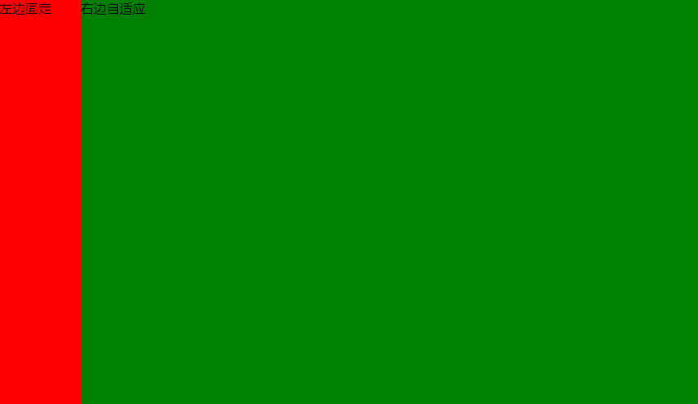
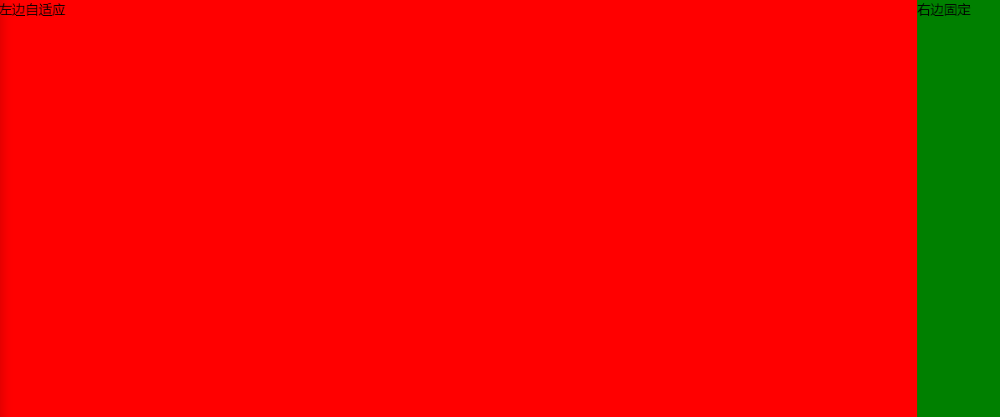
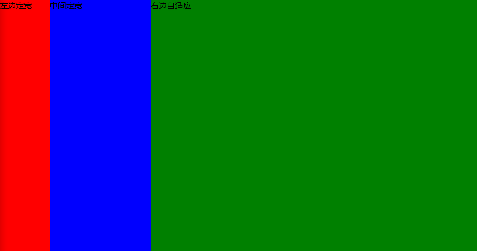
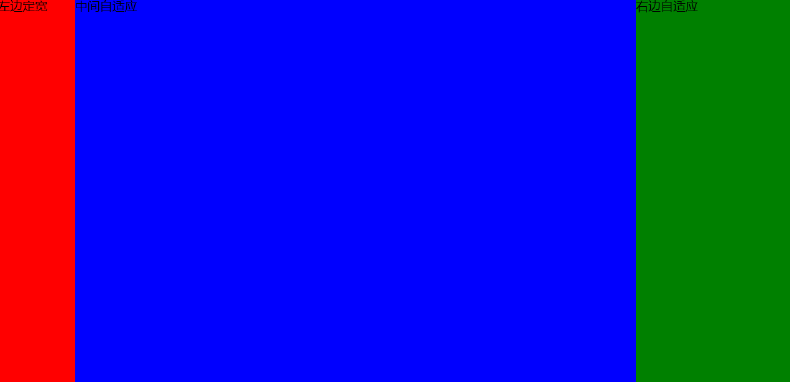

## CSS -- 常见布局方式

@(Interview)

不论什么页面，布局是一个非常重要的概念，能让你的页面变得比较漂亮

这篇博客将总结CSS中的常见布局方式，包括经典的**双飞翼布局**，**圣杯布局**，**居中**，**两栏三栏多栏**布局

废话不多说，直接开始

### 一丶居中布局

居中是一个无处不在的布局，基本什么地方都会用到居中，居中分为**水平居中**，**垂直居中**，**水平垂直居中**

#### 1. 水平居中

对于水平居中，首先要判定元素是不是**行内元素**或者**行内块级元素**

##### (1). text-align
如果	元素是行内元素，代码如下

**HTML内容**

```
<div class="parent">
	<span class="children">sss</span>
</div>
```

`span`是一个行内元素，因此我们只需要给`parent`设置`text-align: center`即可

**CSS**
```
.parent {
	text-align: center;
}
```

##### (2). margin
如果元素是单独的块级元素，可以使用`margin`

**HTML内容**
```
<div class="parent">
	<div class="children">sss</div>
</div>
```
**CSS**
```
.children {
	width: 200px;
	margin: 0 auto;
}
```
> **注意：如果要用`margin`，必须定宽，并且宽度要小于父元素，否则无效**

##### (3). 使用绝对定位

可以使用绝对定位来进行居中，可以定宽也可以不定宽，当然是使用两种方式

**HTML内容**
```
<div class="parent">
	<div class="children">sss</div>
</div>
```
那么如果我们知道`children`的宽度，可以这样设置子元素

**CSS**
```
.children {
	width: 200px;
	position: absolute;
	left: 50%;
	margin-left: -100px;
}
```
如果不知道`children`的宽度，可以使用`transform`

**CSS**
```
.children {
	position: absolute;
	left: 50%;
	transform: translate(-50%);
}
```
> **注意：如果要使用绝对定位，别忘记给父元素设置`position: relative`使子元素基于父元素定位**

##### (4). flex
水平居中，flex是不二之选，既可以单个元素，也可以多个元素的居中

**HTML内容**
```
<div class="parent">
	<div class="children">sss</div>
</div>
```
**CSS**
```
.parent {
	display: flex;
	justify-content: center;
}
```
关于flex布局，我会单独拿出来一篇博客讲

> **注意：flex还是有一些兼容问题的**

#### 2. 垂直居中

垂直居中一样，还是首先看元素是否是**行内元素**或者**行内块级元素**

##### (1). line-height
如果是**行内元素**，我们可以使用`line-height`，只需要将该元素的**行高**等于父元素的**高度**就可以了

**HTML内容**
```
<div class="parent">
	<div class="children">sss</div>
</div>
```
**CSS**
```
.parent {
	height: 40px;
	line-height: 40px; //子元素会继承
}
```

##### (2). 使用`table-cell`实现
使用`table-cell`可以使表格内容对齐方式为`middle`

**HTML内容**
```
<div class="parent">
	<div class="children">sss</div>
</div>
```
需要将父元素的`display`设置为`table-cell`

**CSS**
```
.parent {
	width: 400px;
	height: 200px;
	display: table-cell;
	vertical-align: middle;
}
```

##### (3). 使用绝对定位

同样的，也需要判断是否知道高度

**HTML内容**
```
<div class="parent">
	<div class="children">sss</div>
</div>
```
如果知道`children`的高度，可以这样设置

**CSS**
```
.children {
	height: 200px;
	position: absolute;
	top: 50%;
	margin-top: -100px;
}
```
如果不知道`children`的宽度

**CSS**
```
.children {
	position: absolute;
	top: 50%;
	transform: translateY(-50%);;
}
```

##### (4). flex

**HTML内容**
```
<div class="parent">
	<div class="children">sss</div>
</div>
```
**CSS**
```
.parent {
	display: flex;
	align-items: center;
}
```

#### 水平垂直居中

##### (1). 行内元素
如果是行内元素的水平垂直居中结合上面的即可

**HTML内容**
```
<div class="parent">
	<span class="children">sss</span>
</div>
```
**CSS**
```
.parent {
	height: 100px;
	text-align: center;
	line-height: 100px;
}
```
这样的代码是最简单的，但是却只能给行内元素使用

##### (2). table-cell
 
**HTML内容**
```
<div class="parent">
	<span class="children">sss</span>
</div>
```

**CSS**
```
.parent {
    height: 150px;
    width: 200px;
    display: table-cell;
    vertical-align: middle;
    /*text-align: center;*/   /*如果是行内元素就添加这个*/
}
.children {
    /*margin: 0 auto;*/    /*如果是块级元素就添加这个*/
    width: 100px;
    height: 50px;
}
```

##### (3). button作为父元素

这个方法只适用于行内元素或者行内块级元素，`button`的默认样式就是居中，不要忘记把边框等样式去掉

**HTML内容**
```
<button class="parent">
	<span class="children">sss</span>
</button>
```
**CSS**
```
.parent {
    height: 150px;
    width: 200px;
    outline: none;  
    border: none;
}
```

##### (4). 绝对定位

**HTML内容**
```
<div class="parent">
	<div class="children">sss</div>
</div>
```
**不定宽高**

**CSS**
```
.children {
	position: absolute;
	top: 50%;
	left: 50%;
	transform: transalte(-50%, -50%)
}
```

**固定宽高有两种方法**

**CSS**
```
.children {
	position: absolute;
	width: 100px;
	height: 100px;
	top: 50%;
	left: 50%;
	margin-left: -50px;
	margin-top: -50px;
}
```
```
.children {
	position: absolute;
	width: 100px;
	height: 100px;
	top: 0;
	left: 0;
	right: 0;
	bottom: 0;
	margin: auto
}
```

##### (5). flex

**HTML内同**
```
<div class="parent">
	<div class="children">sss</div>
</div>
```

**CSS**
```
.parent {
	display: flex;
	justify-content: center;
    align-items: center;
}
```

##### (6). vh

可以使用`vh`这个单位，可以形成视窗居中，但是需要设定宽高

**HTML内容**
```
<div class="parent">
	<div class="children">sss</div>
</div>
```
**CSS**
```
.children {
	width: 100px;
	height: 100px;
	margin: 50vh auto 0;
	transform: translateY(-50%);
}
```
---

### 二丶两栏布局

两栏布局常见的有两种情况，我们一种一种来讨论

#### 1. 左列定宽，右列自适应

我们大概要实现一个如图的效果



实现方法有如下几种

##### (1). 利用`float + margin`实现

**HTML内容**
```
	<div class="box">
		<div class="left">
			左边固定
		</div>
		<div class="right">
			右边自适应
		</div>
	</div>
```

**CSS**
```
		.box {
			width: 100%;
			height: 100%;
		}
		.left {
	    	float: left;
	    	width: 100px;
	    	height: 500px;
 			background-color: red;
		}
		.right {
	    	height: 500px;
	    	margin-left: 100px;
			background-color: green;
		}
```

##### (2). 利用`float` + BFC 实现

这个方法的原理是触发一个BFC，因为BFC不与浮动重叠

**HTML内容**
```
	<div class="box">
		<div class="left">
			左边固定
		</div>
		<div class="right">
			右边自适应
		</div>
	</div>
```
**CSS**
```
		.box {
			width: 100%;
			height: 100%;
			overflow: hidden;
		}
		.left {
	    	float: left;
	    	width: 100px;
	    	height: 500px;
 			background-color: red;
		}
		.right {
	    	height: 500px;
	    	overflow: hidden;
			background-color: green;
		}
```

##### (3). 使用`table`实现

**HTML内容**
```
	<div class="box">
		<div class="left">
			左边固定
		</div>
		<div class="right">
			右边自适应
		</div>
	</div>
```

**CSS**
```
		.box {
			width: 100%;
			height: 100%;
			display: table;
		}
		.left {
	    	width: 100px;
	    	height: 500px;
	    	display: table-cell;
 			background-color: red;
		}
		.right {
			height: 500px;
	    	display: table-cell;
			background-color: green;
		}
```

##### (4). 使用绝对定位实现

**HTML内容**
```
	<div class="box">
		<div class="left">
			左边固定
		</div>
		<div class="right">
			右边自适应
		</div>
	</div>
```
**CSS**
```
		.box {
			width: 100%;
			height: 100%;
			position: relative;
		}
		.left {
			top: 0;
			left: 0;
	    	width: 100px;
	    	height: 500px;
	    	position: absolute;
 			background-color: red;
		}
		.right {
			top: 0;
			right: 0;
			left: 100px;
			height: 500px;
	    	position: absolute;
			background-color: green;
		}
```

##### (5). 使用`flex`实现

**HTML内容**
```
	<div class="box">
		<div class="left">
			左边固定
		</div>
		<div class="right">
			右边自适应
		</div>
	</div>
```
**CSS**
```
		.box {
			width: 100%;
			height: 100%;
			display: flex;
		}
		.left {
	    	width: 100px;
	    	height: 500px;
 			background-color: red;
		}
		.right {
			height: 500px;
	    	flex: 1; //均分了父元素剩余空间
			background-color: green;
		}
```

##### (6). 使用Grid实现

**HTML内容**
```
	<div class="box">
		<div class="left">
			左边固定
		</div>
		<div class="right">
			右边自适应
		</div>
	</div>
```

**CSS**
```
		.box {
			width: 100%;
			height: 100%;
			display: grid;
			grid-template-columns: 100px auto;  /*设定2列就ok了,auto换成1fr也行*/
		}
		.left {
			height: 500px;
 			background-color: red;
		}
		.right {
			height: 500px;
			background-color: green;
		}
```

#### 2. 左列自适应，右列定宽

实现的效果正好和刚才的相反，如图



##### (1). 使用`float + margin`实现

**HTML内容**
```
	<div class="box">
		<div class="left">
			左边固定
		</div>
		<div class="right">
			右边自适应
		</div>
	</div>
```
**CSS**
```
		.box {
			/* 注意这里不能设置宽度100%，若要设置，请先切换为IE盒子 */
			height: 100%;
			overflow: hidden;
			padding-left: 100px;
		}
		.left {
			width: 100%;
			height: 500px;
			float: left;
			margin-left: -100px;
 			background-color: red;
		}
		.right {
			height: 500px;
			width: 100px;
			float: right;
			background-color: green;
		}
```

##### (2). 使用`float` + BFC 实现

**HTML内容**

注意，左右盒子位置交换
```
	<div class="box">
		<div class="right">
			右边自适应
		</div>
		<div class="left">
			左边固定
		</div>
	</div>
```

**CSS**
```
		.box {
			width: 100%;
			height: 100%;
			overflow: hidden;
		}
		.left {
			height: 500px;
			overflow: hidden;
 			background-color: red;
		}
		.right {
			height: 500px;
			width: 100px;
			float: right;
			background-color: green;
		}
```

##### (3). 使用`table`实现

**HTML内容**
```
	<div class="box">
		<div class="left">
			左边自适应
		</div>
		<div class="right">
			右边固定
		</div>
	</div>
```

**CSS**
```
		.box {
			width: 100%;
			height: 100%;
			display: table;
		}
		.left {
	    	height: 500px;
	    	display: table-cell;
 			background-color: red;
		}
		.right {
	    	width: 100px;
			height: 500px;
	    	display: table-cell;
			background-color: green;
		}
```

##### (4). 使用绝对定位实现

**HTML内容**
```
	<div class="box">
		<div class="left">
			左边自适应
		</div>
		<div class="right">
			右边固定
		</div>
	</div>
```
**CSS**
```
		.box {
			width: 100%;
			height: 100%;
			position: relative;
		}
		.left {
			top: 0;
			left: 0;
			right: 100px;
	    	height: 500px;
	    	position: absolute;
 			background-color: red;
		}
		.right {
			top: 0;
			right: 0;
			width: 100px;
			height: 500px;
	    	position: absolute;
			background-color: green;
		}
```

##### (5). 使用`flex`实现

**HTML内容**
```
	<div class="box">
		<div class="left">
			左边自适应
		</div>
		<div class="right">
			右边固定
		</div>
	</div>
```
**CSS**
```
		.box {
			width: 100%;
			height: 100%;
			display: flex;
		}
		.left {
	    	height: 500px;
	    	flex: 1; //均分了父元素剩余空间
 			background-color: red;
		}
		.right {
			width: 100px;
			height: 500px;
			background-color: green;
		}
```

##### (6). 使用`Grid`实现

**HTML内容**
```
	<div class="box">
		<div class="left">
			左边自适应
		</div>
		<div class="right">
			右边固定
		</div>
	</div>
```

**CSS**
```
		.box {
			width: 100%;
			height: 100%;
			display: grid;
			grid-template-columns: auto 100px;
		}
		.left {
			height: 500px;
 			background-color: red;
		}
		.right {
			height: 500px;
			background-color: green;
		}
```
---

### 三丶三栏布局

三栏布局中比较常见的有两种，一个一个讲

#### 1. 两列定宽，一列自适应

效果图如下


##### (1). 使用 `float + margin` 实现

**HTML内容**
```
	<div class="box">
		<div class="left">
			左边定宽
		</div>
		<div class="center">
			中间定宽
		</div>
		<div class="right">
			右边自适应
		</div>
	</div>
```

**CSS**
```
		.box {
			width: 100%;
			height: 100%;
		}
		.left {
			float: left;
			width: 100px;
			height: 500px;
			background-color: red;
		}
		.center {
			float: left;
			width: 200px;
			height: 500px;
			background-color: blue;
		}
		.right {
			margin-left: 300px;
			height: 500px;
			background-color: green;
		}
```

##### (2). 使用 `float` + BFC 实现

**HTML内容**
```
	<div class="box">
		<div class="left">
			左边定宽
		</div>
		<div class="center">
			中间定宽
		</div>
		<div class="right">
			右边自适应
		</div>
	</div>
```
**CSS**
```
		.box {
			width: 100%;
			height: 100%;
		}
		.left {
			float: left;
			width: 100px;
			height: 500px;
			background-color: red;
		}
		.center {
			float: left;
			width: 200px;
			height: 500px;
			background-color: blue;
		}
		.right {
			overflow: hidden;
			height: 500px;
			background-color: green;
		}
```

##### (3). 使用`table`实现

**HTML内容**
```
	<div class="box">
		<div class="left">
			左边定宽
		</div>
		<div class="center">
			中间定宽
		</div>
		<div class="right">
			右边自适应
		</div>
	</div>
```
**CSS**
```
		.box {
			width: 100%;
			height: 100%;
			display: table;
		}
		.left {
			display: table-cell;
			width: 100px;
			height: 500px;
			background-color: red;
		}
		.center {
			display: table-cell;
			width: 200px;
			height: 500px;
			background-color: blue;
		}
		.right {
			display: table-cell;
			height: 500px;
			background-color: green;
		}
```

##### (4). 使用`flex`实现
**HTML内容**
```
	<div class="box">
		<div class="left">
			左边定宽
		</div>
		<div class="center">
			中间定宽
		</div>
		<div class="right">
			右边自适应
		</div>
	</div>
```
**CSS**
```
		.box {
			width: 100%;
			height: 100%;
			display: flex;
		}
		.left {
			width: 100px;
			height: 500px;
			background-color: red;
		}
		.center {
			width: 200px;
			height: 500px;
			background-color: blue;
		}
		.right {
			flex: 1;
			height: 500px;
			background-color: green;
		}
```

##### (5). 使用`grid`实现

**HTML内容**
```
	<div class="box">
		<div class="left">
			左边定宽
		</div>
		<div class="center">
			中间定宽
		</div>
		<div class="right">
			右边自适应
		</div>
	</div>
```
**CSS**
```
		.box {
			width: 100%;
			height: 100%;
			display: grid;
			grid-template-columns: 100px 200px auto;
		}
		.left {
			height: 500px;
			background-color: red;
		}
		.center {
			height: 500px;
			background-color: blue;
		}
		.right {
			height: 500px;
			background-color: green;
		}
```

#### 2. 两侧定宽,中间自适应 

这种布局就太常见了，著名的**双飞翼布局**和**圣杯布局**都是这样的，效果图如下



##### (1). 圣杯布局

**HTML内容**
```
	<div class="box">
		<div class="center">
			中间自适应
		</div>
		<div class="left">
			左边定宽
		</div>
		<div class="right">
			右边定宽
		</div>
	</div>
```
**CSS**
```
		.box {
			overflow: hidden;
			width: 100%;
			height: 100%;
			box-sizing: border-box;
			padding: 0 200px 0 100px; //给左右两列留出位置
		}
		.left {
			width: 100px;
			height: 500px;
			float: left;
			margin-left: -100%; //向左移动一个父元素的宽度，元素出现在最左边
			position: relative;
			left: -100px;
			background-color: red;
		}
		.center {
			float: left;
			width: 100%;
			height: 500px;
			background-color: blue;
		}
		.right {
			float: left;
			width: 200px;
			height: 500px;
			left: 200px;
			position: relative;
			margin-left: -200px; //向左移动自身的宽度，元素出现在最右边
			background-color: green;
		}
```

##### (2). 双飞翼布局

**HTML内容**
```
	<div class="box">
		<div class="center">
			中间自适应
		</div>
		<div class="left">
			左边定宽
		</div>
		<div class="right">
			右边定宽
		</div>
	</div>
```
**CSS**
```
		.box {
			overflow: hidden;
			width: 100%;
			height: 100%;
		}
		.left {
			width: 100px;
			height: 500px;
			float: left;
			margin-left: -100%;
			background-color: red;
		}
		.center {
			float: left;
			width: 100%;
			height: 500px;
			box-sizing: border-box;
			padding: 0 200px 0 100px;
			background-color: blue;
		}
		.right {
			float: left;
			width: 200px;
			height: 500px;
			margin-left: -200px;
			background-color: green;
		}
```
##### (3). 使用`table`实现

这种布局也可以使用别的方法实现

**HTML内容**
```
	<div class="box">
		<div class="left">
			左边定宽
		</div>
		<div class="center">
			中间自适应
		</div>
		<div class="right">
			右边自适应
		</div>
	</div>
```
**CSS**
```
		.box {
			display: table;
			width: 100%;
			height: 100%;
		}
		.left {
			width: 100px;
			height: 500px;
			display: table-cell;
			background-color: red;
		}
		.center {
			height: 500px;
			display: table-cell;
			background-color: blue;
		}
		.right {
			width: 200px;
			height: 500px;
			display: table-cell;
			background-color: green;
		}
```

##### (4). 使用`flex`实现

**HTML内容**
```
	<div class="box">
		<div class="left">
			左边定宽
		</div>
		<div class="center">
			中间自适应
		</div>
		<div class="right">
			右边自适应
		</div>
	</div>
```
**CSS**
```
		.box {
			display: flex;
			width: 100%;
			height: 100%;
		}
		.left {
			width: 100px;
			height: 500px;
			background-color: red;
		}
		.center {
			flex: 1;
			height: 500px;
			background-color: blue;
		}
		.right {
			width: 200px;
			height: 500px;
			background-color: green;
		}
```

##### (5). 使用`position`实现

**HTML内容**
```
	<div class="box">
		<div class="left">
			左边定宽
		</div>
		<div class="center">
			中间自适应
		</div>
		<div class="right">
			右边自适应
		</div>
	</div>
```
**CSS**
```
		.box {
			position: relative;
			width: 100%;
			height: 100%;
		}
		.left {
			position: absolute;
			top: 0;
			left: 0;
			width: 100px;
			height: 500px;
			background-color: red;
		}
		.center {
			position: absolute;
			top: 0;
			left: 100px;
			right: 200px;
			height: 500px;
			background-color: blue;
		}
		.right {
			position: absolute;
			top: 0;
			right: 0;
			width: 200px;
			height: 500px;
			background-color: green;
		}
```
---

### 总结

以上就是居中和两栏三栏布局的常用方法，我们在这里再总结一下

#### 1. 水平垂直居中
水平垂直居中需要考虑是否为行内元素

**行内元素**
1. 通过`text-align`和`line-height`设置
2. 通过将父元素设置为`button`
3. 通过`table-cell`

**块级元素**
块级元素需要清楚是定宽还是不定宽

定宽可以通过如下方法
1. 通过`table-cell`
2. 通过`position` + `margin`负值
3. 通过`position` + `margin: auto`的绝对居中方法

不定宽度可以通过如下方法
1. 通过`flex`
2. 通过`position` + `transform`
3. 通过`vh` + `transform`

#### 2. 两栏布局

1. `float + margin`实现
2. `float` + BFC 实现
3. `table`实现
4. 绝对定位实现
5. `flex`实现
6. `grid`实现

#### 3.三栏布局

##### (1). 两列顶宽，一列自适应

1. `float + margin`实现
2. `float` + BFC 实现
3. `table`实现
4. `flex`实现
5. `grid`实现
6. 绝对定位实现

##### (2). 两边定宽，中间自适应

1. 圣杯布局
2. 双飞翼布局
3. `table`实现
4. `flex`实现
5. `grid`实现
6. 绝对定位实现 

---


