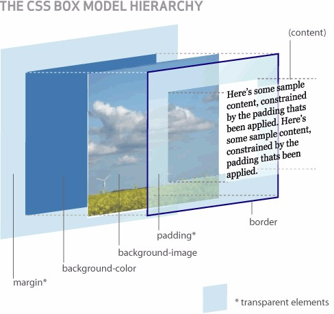
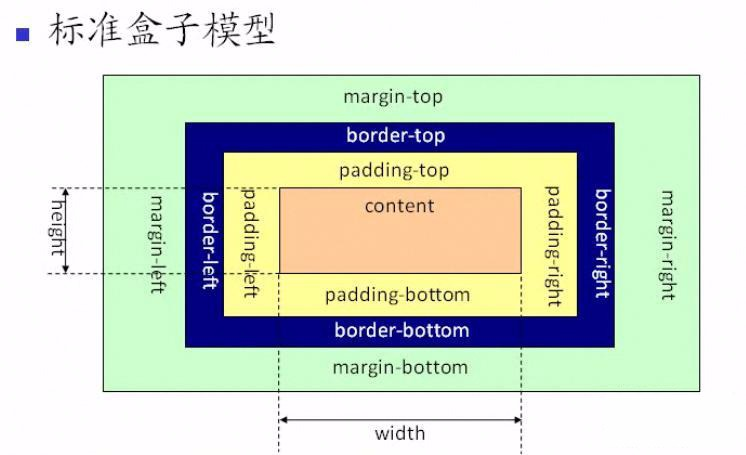
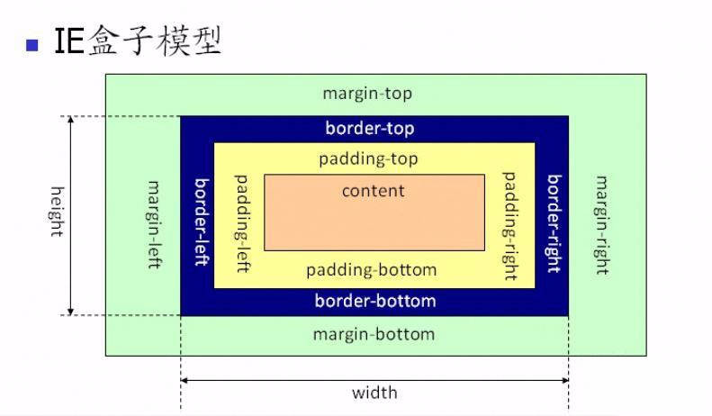

## CSS -- 盒模型

@(Interview)

因为接下来要将`BFC`，所以先把**CSS盒模型**来整理一下重新复习一下

### 一丶简单介绍

我们可以这么想，每个`html`标签都是一个方块，然后这个方块又包着几个小方块，如同盒子一层层的包裹着，这就是所谓的盒模型

那么这个方块里面又有什么呢，它包含了**元素内容(content)**，**内边距(padding)**，**边框(border)**，**外边距(margin)**几个要素。如下图：

再从侧面看一张图

我们来解释一下这张图

**首先在最中心的是元素内容**
**再向外是内边距**
**背景图或背景颜色会将内边距和元素内容一起覆盖**
**再向外是边框**
**最后是外边距**

这样救构成了盒子模型

那我们平时所设置的`width`和`height`属性到底作用于哪里，这就需要分为`IE盒子模型`和`标准盒子模型`了

### 二丶两种盒模型

#### 1.标准盒模型

**W3C标准盒模型规定`width`，`height`属性只包含内容`content`。不包含`border`和`padding`**

也就是说，盒子实际的大小是设置的`width`和`height`再加上设置的`padding`和`border`加起来的总大小

- width = content-width
- height = content-height

#### 2.IE盒子模型

**IE标准盒模型规定`width`，`height`属性包含内容`content`，`border`和`padding`。**

盒子实际的大小只是设置的`width`和`height`，因为`width`和`height`就包含了`padding`和`border`。

- width = content-width + padding-width + border-width
- height = content-height + padding-height + border-height

#### 3.切换盒子模型

**`css`允许我们切换盒子模型，切换两种盒子模型的桥梁就是`box-sizing`属性**

- `box-sizing: content-box`是标准盒子模型
- `box-sizing: border-box`是IE盒子模型

两种盒子模型没有什么好坏之分，不同的情况要使用不同的盒子模型，由自己判断，选择最适合的

---

#####参考
- <a href="https://blog.csdn.net/tianxieliuhong/article/details/53375141">https://blog.csdn.net/tianxieliuhong/article/details/53375141</a>