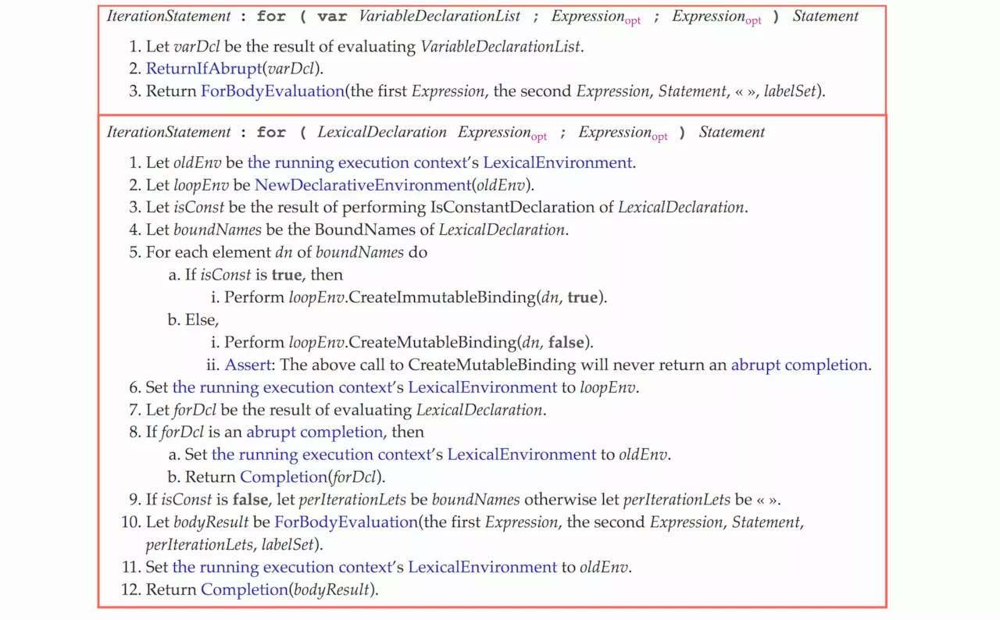

## ESMAScript6 -- let和const

@(Interview)


`let`和`const`是ES6新增的两个声明变量的方法，这篇博客将详细介绍他们的用法，这篇博客大量的参考了阮一峰老师的ES6入门教程

### 一丶块级作用域简介
在介绍这两个命令前，我们需要先来介绍一下**块级作用域**

众所周知，JS是一门对于**块级作用域**很不友好的语言，大部分情况下只有**全局作用域**和**函数作用域**，这可以说是一件很不合理的事情，所以ES6的`let`可以说是为JS添加了最完美的块级作用域。

#### 为什么需要块级作用域

有许多场景，因为没有块级作用域导致了许多的问题，我们来看一下这些问题

**首先，内层的变量可能会覆盖外层变量**
```
var tmp = new Date();
function f() {
	console.log(tmp);
	if (false) {
		var tmp = 'hello world';
	}
}
f(); //undefined
```
由于没有块级作用域，导致了`tmp`变量提升，在`console.log`之前定义了`tmp`并且覆盖了全局的`tmp`，但是没有给它赋值，所以执行结果为`undefined`，这本来是一种很正常的操作，却因为没有块级作用域导致了问题出现

**再来看看计数的循环变量泄露为全局变量**
```
var s = 'hello';

for (var i = 0; i < s.length; i++) {
  console.log(s[i]); 
}

console.log(i); // 5
```
上面的代码，变量`i`只是用来控制循环，但是循环结束后，它并没有消失，泄露成为了全局变量

所以块级作用域是很重要的，因此有了`let`和`const`

---

### 二丶let

#### 1.基本用法

`let`命令的用法类似与`var`，但是所声明的变量，只在let命令所在的代码块内有效

```
{
	let a = 10;
	var b = 1; 
}
console.log(a) // ReferenceError: a is not defined.
console.log(b) // 1
```
上面代码在代码块之中，分别用`let`和`var`声明了两个变量，然后在**代码块之外**调用这两个变量，结果`let`声明的变量**报错**，`var`声明的变量返回了正确的值。这表明，**`let`声明的变量只在它所在的代码块有效**

循环计数器救我们就可以用`let`来写
```
for (let i = 0; i < 10; i++) {
  // ...
}
console.log(i); // ReferenceError: i is not defined
```
上面代码中，计数器`i`只在`for`循环体内有效，在循环体外引用就会报错

#### 2.形成块级作用域

从上面的例子我们已经可以看出来，`let`实际上为 JavaScript 新增了块级作用域
```
function f1() {
  let n = 5;
  if (true) {
    let n = 10;
  }
  console.log(n); // 5
}
```
上面的函数有两个代码块，都声明了变量`n`，运行后输出 5 ，这表示外层代码块不受内层代码块的影响。如果两次都使用`var`定义变量`n`，最后输出的值是 10

 - **内层作用域可以定义外层作用域的同名变量**
 - **外层作用域无法读取内层作用域的变量**

块级作用域的出现，实际上使得获得广泛应用的立即执行函数表达式不再必要了
```
// IIFE写法
(function () {
	var tmp = ...;
	...
}());
// 块级作用域写法
{
	let tmp = ...;
}
```
块级作用域使代码变得更加合理，格式也更加清晰

#### 3.不存在变量提升

`var`命令会发生**变量提升**现象，即变量可以在声明之前使用，值为`undefined`。这种现象是有些奇怪的，按照一般的逻辑，变量应该在声明语句之后才可以使用。

为了纠正这种现象，`let`命令改变了语法行为，它所声明的变量一定要在声明后使用，否则报错

```
// var 的情况
console.log(foo); // 输出undefined
var foo = 2;

// let 的情况
console.log(bar); // 报错ReferenceError
let bar = 2;
```
上面代码中，变量`foo`用`var`命令声明，会发生变量提升，即脚本开始运行时，变量`foo`已经存在了，但是没有值，所以会输出`undefined`。变量`bar`用`let`命令声明，不会发生变量提升。这表明在声明它之前，变量`bar`是不存在的，这时如果用到它，就会抛出一个错误

#### 4.不允许重复声明

`let`不允许在**相同的作用域内**，重复声明同一个变量

```
// 报错
function func() {
  let a = 10;
  var a = 1;
}

// 报错
function func() {
  let a = 10;
  let a = 1;
}
```
因此，不能在函数内部重新声明参数
```
function func(arg) {
  let arg; // 报错
}

function func(arg) {
  {
    let arg; // 不报错
  }
}
```

#### 5. 暂时性死区

这是一个新名词，暂时性死区是由`let`和`const`造成的

只要在块级作用域内存在`let`命令，它所声明的变量就**“绑定”**了这个区域，不再受到外部的影响
```
var tmp = 123;

if (true) {
  tmp = 'abc'; // ReferenceError
  let tmp;
}
```
上面的代码，存在全局变量`tmp`，但是块级作用域内`let`又声明了一个局部变量`tmp`，导致后者**绑定了这个块级作用域**，所以在`let`声明变量前，对`tmp`赋值会报错。

ES6 明确规定，如果区块中存在`let`和`const`命令，这个区块对这些命令声明的变量，从一开始就形成了**封闭作用域**。凡是在声明之前就使用这些变量，就会报错

比如这样可以
```
let a = 10;
if (true) {
	let a = 20;
}
```
但是这样就不行
```
let a = 10;
if (true) {
	a = 20;
	let a = 20;
}
```
不同的作用域内可以重复声明，但是不能在重复声明前调用

总之，在代码块内，使用`let`命令声明变量之前，该变量都是不可用的。这在语法上，成为**暂时性死区**

那这样也就意味着`typeof`不再是一个百分百安全的操作
```
typeof x; // ReferenceError
let x;
```
上面代码中，变量`x`使用`let`命令声明，所以在声明之前，都属于`x`的死区，只要用到该变量就会报错，因此，`typeof`运行时就会抛出错误

作为比较，如果一个变量根本没有被声明，使用`typeof`反而不会报错
```
typeof a // "undefined"
```
上面代码中，`a`是一个不存在的变量名，结果返回`undefined`。但是这一点现在肯定是不成立了，如果直接`typeof a`是一定会报错的，这样就是为了让大家养成好习惯，在使用变量前一定要声明

有些死区是非常隐蔽的，需要大家善于发现
```
function bar(x = y, y = 2) {
  return [x, y];
}

bar(); // 报错
```
上面的代码报错是因为在给形参`x`赋初值时，`y`还没有被定义，也就是说形成了死区，如果两个形参调换位置，就不会报错了

#### 6. for循环中的let

为什么要把`for`循环中的`let`单独拎出来呢，因为这种情况确实很特殊

我们先来使用`var`来写一个循环，最后将输出的是`10`
```
var a = [];
for (var i = 0; i < 10; i++) {
	a[i] = function () {
		console.log(i);
	}
}
a[6](); // 10
```
这是因为，变量`i`是`var`命令声明的，在**全局范围内**都有效，所以全局只有一个变量`i`。每次循环，变量`i`的值都会**发生改变**，而循环内被赋值给数组`a`的函数内部的`console.log(i)`，里面的`i`指向的就是**全局的`i`**。也可以看成是这样
```
var a = [];
var i = 0;
for (; i < 10; i++) {
	a[i] = function () {
		console.log(i);
	}
}
a[6](); // 10
```
这样就比较好理解了，所有数组`a`的成员里面的`i`，指向的都是**同一个`i`**，所以导致运行时输出的是最后一轮的`i`的值，也就是 10。

**如果使用let，声明的变量仅在块级作用域内有效，最后输出的是6**
```
var a = [];
for (let i = 0; i < 10; i++) {
  a[i] = function () {
    console.log(i);
  };
}
a[6](); // 6
```
上面代码中，变量`i`是`let`声明的，当前的`i`只在**本轮循环有效**，所以每一次循环的`i`其实都是一个**新的变量**，所以最后输出的是`6`

但是不觉的怪吗，如果每一次循环的`i`都是一个**新的变量**，那么在同一作用域内重复声明变量按理说是要报错的，但是却很顺畅的执行下来了

其实，这些新的变量，**并不是在同一个作用域内**，来看个例子
```
let i = 'ddd';
for (let i = 0; i < 3; i++) {
  let i = 'abc';
  console.log(i);
}
console.log(i);

// abc
// abc
// abc
// ddd
```
上面代码正确运行，输出了3次`abc`和1次`ddd`。这表明循环变量`i`和循环内部的变量`i`和循环外部的变量`i`都**不在同一个作用域**，**而是有各自单独的作用域**

其实这**ECMAScript 规范**中有明确规定


在`for`循环中使用`let`和`var`，底层会使用不同的处理方式

而在一个使用`let`的`for`循环中，设置循环变量的那部分是一个**父作用域**，而循环体内部是一个**单独的子作用域**，简单的来说，就是在`for (let i = 0; i < 3; i++)`中，就是圆括号之内建立了一个**隐藏的作用域**

然后在**每次迭代循环时创建一个新变量，并以之前迭代中同名变量计算后的值将其初始化**。那么上面的代码也就相当于下面这样

```
// 伪代码
(let i = 0) {
	let i = 'abc';
	console.log(i);
}
(let i = 1) {
	let i = 'abc';
	console.log(i);
}
(let i = 2) {
	let i = 'abc';
	console.log(i);
}
```
这样就很清楚明白了

##### 还有最后一个问题，const(建议看完const介绍后再看这一段)

如果将上面的`let`替换成`const`结果又会是什么呢
```
for (const i = 0; i < 3; i++) {
  const i = 'abc';
  console.log(i);
}
// abc
// Uncaught TypeError: Assignment to constant variable.
```
可以看到，会先打印一遍`abc`，然后报错，说明第一次正常打印，问题出在之后
这是因为虽然每次的值都是在独立作用域中重新声明的，**但是在迭代的时候会有计算的过程**，尝试修改常量就会报错


---

### 三丶const
#### 1.基本用法
`const`的使用方法和`let`一样，只不过它声明的是一个常量，不允许改变
```
const PI = 3.1415;
PI // 3.1415
PI = 3;
// TypeError: Assignment to constant variable.
```
上面代码表明**改变常量的值会报错**

这也就意味着，`const`一旦声明变量，就必须立即初始化，不能留到以后赋值
```
const a;
// SyntaxError: Missing initializer in const declaration
```
上面代码表明，对于`const`来说，**只声明并不赋值，就会报错**

`const`的作用域与`let`命令相同：**只在声明所在块级作用域内有效**

`const`命令声明的常量也是不提升，同样存在暂时性死区，只能在声明的位置后面使用。

`const`命令声明的常量，也与`let`一样不可重复声明

一切规则都和`let`一样，多了两条限制
- 不允许改变常量的值
- 不允许只声明不赋值

#### 2.本质

`const`实际上保存的，并不是变量的值不得改动，而是**变量指向的那个内存地址所保存的数据不得改动**。

这就要分情况来讨论了，对于**简单类型的数据(数值，字符串，布尔值)，值就保存在变量指向的那个内存地址，因此等同于常量。**

但是对于**复合类型的数据(主要是对象和数组)，变量指向的内存地址，保存的只是一个指向实际数据的指针**，`const`只能保证这个指针是固定的(即总是指向另一个固定的地址)，至于它指向的数据结构是不是可变的，就完全不能控制了。因此，**将一个对象声明为常量必须非常小心了**

```
const foo = {};

// 为 foo 添加一个属性，可以成功
foo.prop = 123;
foo.prop // 123

// 将 foo 指向另一个对象，就会报错
foo = {}; // TypeError: "foo" is read-only
```
上面的代码中，常量`foo`储存的是一个地址，这个地址指向一个对象。**不可变的只是这个地址**，即不能把`foo`指向另一个地址，**但对象本身是可变的**，所以依然可以为其添加新属性。

再来看一个例子
```
const a = [];
a.push('Hello'); // 可执行
a.length = 0;    // 可执行
a = ['Dave'];    // 报错
```

**如果真的想将对象冻结，应该使用`Object.freeze`**方法，这个就不在我们讨论范围之内了，想了解的可以去看我博客

### 四丶顶层对象的属性

顶层对象，在浏览器环境指的是`window`对象，在Node值的是`global`对象。在ES5之中，顶层对象的属性与全局变量是等价的
```
window.a = 1;
a // 1

a = 2;
window.a // 2
```
这是一个很不好的规则，ES6为了改变这一点，一方面规定，为了保持兼容性，`var`命令和`function`命令声明的全局变量依旧是顶层对象的属性；另一方面，`let`命令，`const`命令，`class`命令声明的全局变量	，不属于顶层对象的属性。也就是说，**从 ES6 开始，全局变量将逐步与顶层对象的属性脱钩**
```
var a = 1;
// 如果在 Node 的 REPL 环境，可以写成 global.a
// 或者采用通用方法，写成 this.a
window.a // 1

let b = 1;
window.b // undefined
```
上面代码中，全局变量`a`由`var`命令声明，所以它是顶层对象的属性；全局变量`b`由`let`命令声明，所以它不是顶层对象的属性，返回`undefined`。

---

### 总结

我们来总结下`let`和`const`的规则

#### let
 - `let`会形成**块级作用域**
 - `let`命令**不会变量提升**
 - 在同一个作用域内，`let`**不允许重复声明**
 - 会形成**暂时性死区**，如果在声明前使用变量，会报错
 - `let`声明的全局变量，**不属于顶层对象的属性**
 - 在形如`for(let x = 0...)`循环中，每回都会在独立的隐藏作用域中重新声明一个`x`，`JavaScript`引擎会把每一次的`x`记住，然后计算下一次的`x`值

#### const

 - `const`会形成**块级作用域**
 - `const`命令**不会变量提升**
 - 在同一个作用域内，`const`**不允许重复声明**
 - 会形成**暂时性死区**，如果在**声明前使用变量，会报错**
 - `const`声明的全局变量，**不属于顶层对象的属性**
 - `const`声明的变量，**不允许改变**
 - `const`**不允许只声明不赋值**
 - `const`声明的变量，不允许改变的是**变量指向的那个内存地址所保存的数据**

---

#####参考
- <a href="http://es6.ruanyifeng.com/#docs/let#const-%E5%91%BD%E4%BB%A4">http://es6.ruanyifeng.com/#docs/let#const-%E5%91%BD%E4%BB%A4</a>
- <a href="https://juejin.im/post/5b0238f66fb9a07aca7a74ba">https://juejin.im/post/5b0238f66fb9a07aca7a74ba</a>;

---
