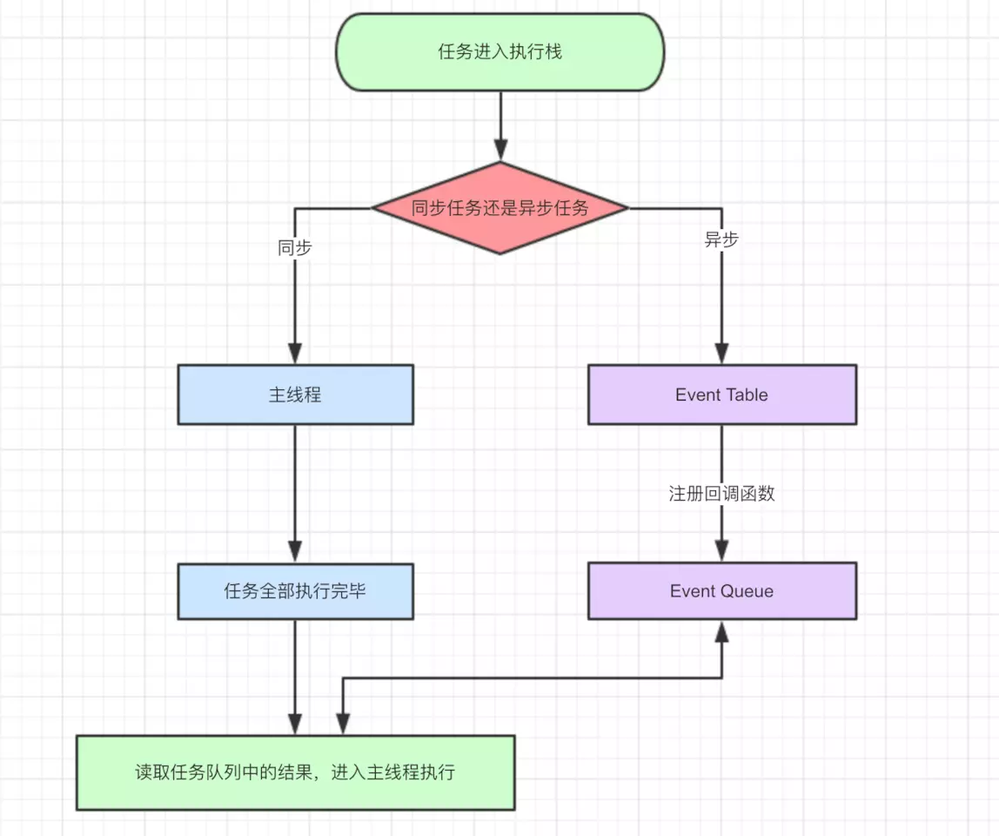

## JavaScript -- 事件循环(Event Loop)

@(Interview)

### 前言

我们能讲这个问题，就是因为 JS 它是一个单线程的脚本语言，在同一时间，只能做同一件事，为了 协调事件，用户交互，脚本，UI渲染和网络处理等行为，**防止主线程阻塞**，才有了事件循环机制。

**为什么要设置成单线程**

`JS`作为主要运行在浏览器的脚本语言，它的主要用途是操作 DOM。

在 `JS` 高程中举过一个例子，如果 `JS` 同时有两个线程，同时对同一个 `DOM` 进行操作，这时浏览器应该听哪个线程的，如何判断优先级

为了避免这种问题，`JS` 必须是一门单线程语言，并且在未来这个特点也不会改变。**所以一切 `JS` 版的"多线程"都是用单线程模拟出来的**

### 一丶浏览器内核的多线程

什么意思，不是刚说 `JS` 是单线程码，这怎么又提多线程了。

这是**浏览器内核**的多线程。虽然本文旨在解决 `JS` 的执行机制，但是这里必须简单提以下，如果想看更多的，之后会写

#### 1. 浏览器是多进程的


**首先一个浏览器一定是多进程的，而浏览器内核属于其中一个进程，它是多线程的**

可以自己打开 `Chrome` 浏览器

`Chrome` 浏览器的多个标签页，然后可以在 `Chrome` 的任务管理器中看到有多个进程（分别是每一个 `Tab` 页面有一个独立的进程，以及一个主进程）。

感兴趣的可以自行尝试下，如果再多打开一个Tab页，进程正常会+1以上

**注意：**在这里浏览器应该也有自己的优化机制，有时候打开多个tab页后，可以在Chrome任务管理器中看到，有些进程被合并了（所以每一个Tab标签对应一个进程并不一定是绝对的）

#### 2. 浏览器包含了哪些进程

浏览器既然是多进程的，那么它究竟包含了哪些进程

##### (1). `Browser`进程

浏览器的主进程（负责协调，主控），只有一个。作用如下：

- 负责浏览器界面显示，与用户交互。如前进，后退等
- 负责各个页面的管理，创建和销毁其他进程
- 将 `Renderer` 进程得到的内存中的 `Bitmap`，绘制到用户界面上
- 网络资源的管理，下载等

##### (2). 第三方插件进程

每种类型的插件对应一个进程，仅当使用该插件时才创建

##### (3). GPU进程

最多只有一个，用于3D绘制

##### (4). 浏览器渲染进程（浏览器内核）

这就是标题说的**浏览器内核**，每个 `Tab` 页面都会有一个进程，互相不影响。

它的主要作用是**页面渲染，脚本执行，事件处理**

**这个进程内部是多线程的**，

#### 3. 浏览器内核的线程

我们的重点就是这个浏览器内核，也就是浏览器渲染进程，今天故事的主角就是发生在这里

因为我们的工作大多数就只在这里了，其他的工作和我们关系并不大，所以需要重点学习这儿

它里面的线程如下

##### (1). GUI 渲染线程

- 负责渲染浏览器界面，解析 `HTML`，`CSS`，构建 `DOM`树和`RenderObject`树，布局和绘制等
- 当界面需要重绘，或由于某种操作引发回流时，该线程就会执行
- 注意，**GUI渲染线程与JS引擎线程是互斥的**，当JS引擎执行时GUI线程会被挂起（相当于被冻结了），GUI更新会被保存在一个队列中**等到`JS`引擎空闲时**立即被执行。

##### (2). JS 引擎线程

- 也称为 JS 内核，负责处理 `JavaScript` 脚本程序（例如V8引擎）
- JS 引擎线程负责解析 `JavaScript`脚本，运行代码
- JS引擎一直等待着任务队列中任务的到来，然后加以处理，一个Tab页（renderer进程）中无论什么时候都只有一个JS线程在运行JS程序
- 同样注意，**GUI渲染线程与JS引擎线程是互斥的**，所以如果JS执行的时间过长，这样就会造成页面的渲染不连贯，导致页面渲染加载阻塞。

##### (3). 事件触发线程

- 归属于浏览器而不是JS引擎，用来控制事件循环（可以理解，JS引擎自己都忙不过来，需要浏览器另开线程协助）
- 当 JS 引擎执行代码块如 `setTimeout`时（也可来自浏览器内核的其他线程,如鼠标点击、AJAX异步请求等），会将对应任务添加到事件线程中
- 当对应的事件符合触发条件被触发时，该线程会把事件添加到待处理队列的队尾，**等待JS引擎的处理**
- 注意，由于 `JS` 的单线程关系，所以这些待处理队列中的事件都得排队等待JS引擎处理（当JS引擎空闲时才会去执行）

##### (4). 定时器触发线程

- 传说中的 `setInterval` 与 `setTimeout` 所在线程
- 浏览器定时计数器并不是由 `JavaScript` 引擎计数的,（因为 `JavaScript` 引擎是单线程的, 如果处于阻塞线程状态就会影响记计时的准确）
- 因此通过单独线程来计时并触发定时（计时完毕后，添加到事件队列中，等待JS引擎空闲后执行）
- 注意，`W3C` 在 `HTML` 标准中规定，规定要求 `setTimeout` 中低于 `4ms` 的时间间隔算为`4ms`。

##### (5). 异步`http`请求线程

- `XMLHttpRequest` 在连接后是通过浏览器新开一个线程请求.
- 将检测到状态变更时，如果设置有回调函数，异步线程就产生状态变更事件，将这个回调再放入事件队列中。再由 `JavaScript` 引擎执行。

---


### 二丶Event Loop

终于到正题了，讲了这么多，就是因为正题用到了上面说到的几个线程。

我们会用到

- JS 引擎线程
- 事件触发线程
- 定时器触发线程

#### 1. 事件循环

在说这个之前，还需要理解两个概念

- 同步任务
- 异步任务


**同步任务**：同步任务都在主线程上执行（也就是 **JS 引擎线程**），形成一个 `执行栈`
**异步任务**：异步任务会在别的线程上工作，比如`setTimeout`会在定时器触发线程，`AJAX`请求会在网络请求线程。而在**事件触发线程**管理着一个**任务队列**，只要异步任务有了运行结果，就在**任务队列**之中放置一个事件，等待主线程调用

我们用一张图来看：



图片中的流程是这样的：

1. 一个任务进入执行栈以后查看该任务是同步任务还是异步任务
2. 如果是同步任务在主线程下执行，如果是异步任务则交给其他线程
3. 其他线程执行完任务后，将对应的**回调函数**放入事件触发线程的任务队列。
4. 主线成的任务执行完毕，执行栈为空，去任务队列读取对应的回调函数，进入主线程执行。
5. 执行完后会再去任务队列寻找，不断重复

这样不断循环往复的过程就是事件循环。

**注意：**只有当主线程空闲以后，才会去读取事件队列中的事件，**如果主线程还在执行，任务队列里的事件就会一直等待**


#### 2. 举个例子

如果现在有这样一段代码

```
let data = [];
$.ajax({
    url:www.javascript.com,
    data:data,
    success:() => {
        console.log('发送成功!');
    }
})
console.log('代码执行结束');
```
它的执行过程是怎么样的呢

首先，看到了`Ajax`任务，调用**网络请求线程**，去请求资源，主线程继续执行`console.log`。数据请求回来以后，`Ajax`事件完成，将回调函数`success`放入任务队列，主线程执行完后，从任务队列里读取`success`函数执行

---

### 三丶 定时器

#### 1. setTimeout
定时器的原理也是这样的，但是定时器有时候不准确就是因为主线程的代码执行时间过长。

比如咱们看下面的代码

```
setTimeout(() => {
    console.log('zhao')
},3000)

sleep(10000)
```
JS 是没有`sleep`函数的，咱们假设有这样一个函数可以阻塞主线程，阻塞了 10 秒钟。

那么字符串`zhao`一定会是 10 秒钟后输出，而不会是预期的 3 秒钟。

原因很简单，就是因为**主线程一直在阻塞**，所以虽然3秒以后函数被放入任务队列里了，但是主线程没有空，是不会去任务队列里获取回调函数并执行的

再看个例子

```
setTimeout(() => {
    console.log('zhao');
}, 0);

console.log('li');
```
这样是一定先输出`li`再输出`zhao`的。原理同上，会先执行主线程的任务。

**注意：**虽然代码的本意是 0 毫秒后就推入事件队列，但是 `W3C` 在 `HTML` 标准中规定，规定要求 `setTimeout` 中低于 `4ms` 的时间间隔算为 `4ms`

#### 2. setInterval 

`setInterval` 和`setTimeout`的机制一样。只不过它是循环执行。

循环执行就会有一些问题出现

试想一下，**如果`setInterval`设置的回调函数执行时间要比你设置的循环时间长，那么就看不出来有时间间隔了**，结合前面讲的，可以好好理解下这句话

这里对于定时器讲的皮毛都算不上，详细的介绍之后会写

---

### 四丶 宏任务与微任务

这是在 `ES6`里的两个新名词，我们先介绍一下

#### 1. what

宏任务(`macrotask`)，可以理解是**每次执行栈执行的代码就是一个宏任务**，宏任务的特点是：
- 每一个`macrotask`会从头到尾将这个任务执行完毕，不会执行其他
- 浏览器为了能够使得 JS 内部 `macrotask`与 `DOM` 任务能够有序的执行，会在一个 `macrotask` 执行结束后，在下一个 `macrotask` 执行开始前，对页面进行重新渲染

微任务(`microtask`)，可以理解是**在当前 `macrotask` 执行结束后立即执行的任务**，微任务的特点：
- 也就是说，在当前`macrotask`任务后，下一个`macrotask`之前，**在渲染之前**
- 所以它的响应速度相比 `setTimeout` 会更快，因为无需等待渲染
- 也就是说，在某一个 `macrotask` 执行完后，就会将在它执行期间产生的所有 `microtask` 都执行完毕（在渲染前）

都有什么是宏任务或微任务呢

**宏任务：**
- 主代码块
- `setTimeout`
- `setInterval`

**微任务：**
- `Promise`
- `process.nextTick`

#### 2. 运行机制

宏任务和微任务的执行时间是不同的，不同类型的任务会进入对应的 `Event Queue` ，比如 `setTimeout` 和 `setInterval` 会进入相同的 `Event Queue`。

事件循环的顺序，决定 `JS` 代码的执行顺序。进入整体代码(宏任务)后，开始第一次循环。**接着执行所有的微任务**。然后再次从宏任务开始，找到其中一个任务队列执行完毕，再执行所有的微任务，听起来有点绕。看一段代码

```
setTimeout(function() {
    console.log('setTimeout');
})

new Promise(function(resolve) {
    console.log('promise');
}).then(function() {
    console.log('then');
})

console.log('console');
```

这段代码的执行顺序是这样的
- 这段代码作为宏任务，进入主线程。
- 先遇 `setTimeout`，那么将其回调函数注册后分发到宏任务 `Event Queue`。
- 接下来遇到了`Promise`，`new Promise` 立即执行，`then` 函数分发到微任务 `Event Queue`。遇到 `console.log()`，立即执行。
- 整体代码 `script` 作为第一个宏任务执行结束，然后在**微任务队列**里寻找微任务，发现有`then`，执行
- 到此，第一轮时间循环算是结束了，然后开始第二轮循环，从**宏任务队列**寻找下一个宏任务，发现了`setTimeout`对应的回调函数，然后执行。
- 结束

我们通过这个例子总结一下运行机制

- 执行一个宏任务（栈中没有就从事件队列中获取）
- 执行过程中如果遇到微任务，就将它添加到微任务的任务队列中
- 宏任务执行完毕后，立即执行当前微任务队列中的所有微任务（依次执行）
- 当前宏任务执行完毕，开始检查渲染，然后GUI线程接管渲染
- 渲染完毕后，JS线程继续接管，开始下一个宏任务（从事件队列中获取）

如图：


如果还是不理解，可以自己试一试。

现在我们所讲的都是浏览器的情况，但是别忘了，我们的 `JS` 还是可以运行在 `Node`中，接下来我们讲一讲 `node`中的事件循环

---

#### 五丶node中的事件循环

上面有了宏任务微任务的区分后，一个事件队列就被改成两个事件队列。其实在 `Node.js` 里有更多的事件队列。

它的规则要比浏览器的循环复杂的多

---

##### 参考：
- <a href="https://juejin.im/post/5a6547d0f265da3e283a1df7">https://juejin.im/post/5a6547d0f265da3e283a1df7</a>
- <a href="https://juejin.im/post/59e85eebf265da430d571f89">https://juejin.im/post/59e85eebf265da430d571f89</a>
- <a href="https://juejin.im/post/5a437441f265da43294e54c3">https://juejin.im/post/5a437441f265da43294e54c3</a>
- <a href="https://juejin.im/post/5a6c60166fb9a01caf37a5e5">https://juejin.im/post/5a6c60166fb9a01caf37a5e5</a>

---
