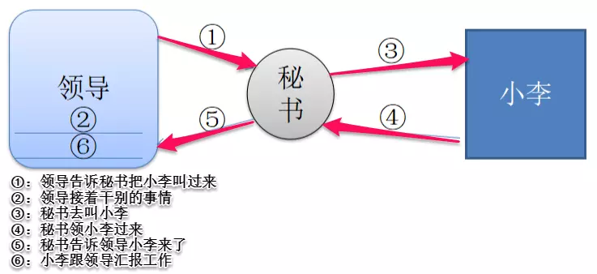
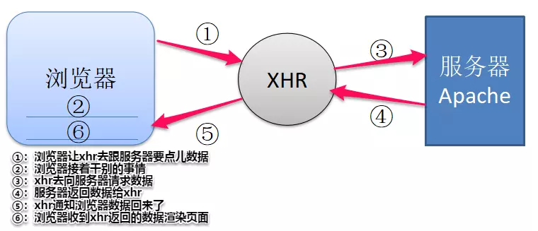

## JavaScript -- Ajax

@(Interview)

终于等到了`ajax`，用了这么长时间，是时候总结一下了

### 前言

说到`ajax`，我们得提一下它的历史，它怎么来的，又是为何而来


在上世纪90年代，几乎所有的网站都由`HTML`页面实现，服务器处理每一个用户请求都需要重新加载网页。
形式是怎样的呢？就比如说你在浏览器上登录自己的微博账号，填完了表单，点击登录按钮，一次"完整"的`HTTP`请求就此触发，服务器发现你的登录密码不对头，立马把网页原原本本的返回给你，在用户看来呢，就是一次重新加载的过程！**用户体验极差**！而且这个做**法浪费了许多带宽**，因为在前后两个页面中的大部分`HTML`码往往是相同的。由于每次应用的沟通都需要向服务器发送请求，应用的回应时间依赖于服务器的回应时间。这导致了用户界面的回应比本机应用慢得多。

到了 2005 年，`google`率先在它的应用里使用了`ajax`技术，这才让这项技术正式风靡开来

---

### 一丶Ajax简介

#### 1. Ajax是什么

`ajax`全称 `Asynchronous Javascript And XML`（异步的`JavaScript`和`XML`）

它是一种异步请求数据的`web`开发技术，对于改善用户的体验和页面性能很有帮助。简单地说，在不需要重新刷新页面的情况下，`Ajax` 通过异步请求加载后台数据，并在网页上呈现出来。
它的目的就是**提高用户体验，较少网络数据的传输量**
 

其实它并不是一种单一的技术，而是**有机利用一系列交互式网页应用相关的技术所形成的结合体**，其中包含了如下几种
- 使用`CSS`和`XHTML`来表示。
- 使用`DOM`模型来交互和动态显示。
- 使用`XMLHttpRequest`来和服务器进行异步通信。
- 使用`javascript`来绑定和调用。


#### 2. Ajax的工作原理

Ajax的工作原理相当于在用户和服务器之间加了一个**中间层**(`ajax`引擎)，使用户操作与服务器响应**异步化**。
并不是所有的用户请求都提交给服务器，像—些数据验证(比如判断用户是否输入了数据)和数据处理(比如判断用户输入数据是否是数字)等都交给`Ajax`引擎自己来做，只有确定需要从服务器读取新数据时再由`Ajax`引擎代为向服务器提交请求。
把这些交给了`Ajax`引擎，用户操作起来也就感觉更加流畅了。

光说好像不太好理解，我们看一个好理解的例子

##### 好理解的例子

现在有这样几种角色：**领导**，**秘书**，**小李同志**

有一天，领导想找小李问点事，就委托秘书去叫小李，自己就接着做其他事情，直到秘书告诉他小李已经到了，最后小李跟领导汇报工作。



然后我们将这个过程类比`ajax`过程，领导就是**客户端**，秘书就是`ajax`的核心**`XMLHttpRequest`对象**，小李就是**服务器**

那么接下来就变成这样一张图
 


这就是`ajax`做的工作

---

### 二丶Ajax的使用

#### 1. 创建 `XMLHttpRequest` 对象

对于`Ajax`，它的核心是 `XMLHttpRequest` 对象，它是 `Ajax` 实现的关键，**发送异步请求**，**接受响应**以及**执行回调**都是通过它来完成的

所有现代浏览器（`IE7+`、`Firefox`、`Chrome`、`Safari` 以及 `Opera`）均内建 `XMLHttpRequest` 对象。

**创建 `XMLHttpRequest` 对象**

```
let xhr = new XMLHttpRequest();
```

不过需要考虑`IE5`和`IE6`的兼容问题，所以如果是`IE5`或`IE6`，则如下
```
let xhr = new ActiveXObject("Microsoft.XMLHTTP");
```

那么为了考虑兼容性，所以在创建前需要检查浏览器是否支持 `XMLHttpRequest` 对象，如果支持，则创建 `XMLHttpRequest` 对象，不支持则创建 `ActiveXObject`：

```
function createRequest (){
	let xhr = null;
    try {
        xhr = new XMLHttpRequest();
    } catch (tryMS) {
        try {
            xhr = new ActiveXObject("Msxm12.XMLHTTP");
        } catch (otherMS) {
            try {
                xhr = new ActiveXObject("Microsoft.XMLHTTP");
            } catch (failed) {
                xhr = null;
            }
        }
    }
    return xhr;
}
```

这样就创建好一个`XMLHttpRequest`对象


#### 2. 准备请求

现在已经创建好了 `XMLHttpRequest `对象，可以对它进行初始化了，它接受三个参数

```
xhr.open(method, url, async);
```

有三个参数：
- `method`：第一个参数表示请求类型的字符串，其值可以是`GET`或者`POST`
- `url`：这个参数是要作为请求发送目标的`URL`
- `async`(可选)：一个布尔参数，**这个参数表示请求是以异步还是同步执行**，如果是`true`则是异步执行，`false`为同步执行，默认为`true`。一般不建议为 `false`。

其实还有两个参数，但是一般不会用，但是还是提一下

- `user`(可选)：可选的**用户名**用于认证用途，默认为`null`
- `password `(可选)：可选的**密码**用于认证用途，默认为`null`

#### 3. 发送请求

```
xhr.send();
```

发送请求需要分为`GET`和`POST`

如果是**`GET`方法**，我们把参数直接写在`url`的后面就可以了

```
xhr.open("GET", demo.php?name=zhao&age=24, true);
xhr.send();
```

但是如果是**`POST`方法**，我们需要添加一个`HTTP`请求头。然后在`send()`方法中规定希望发送的数据

```
xhr.open("POST", demo.php, true);
xhr.setRequestHeder("Content-Type","application/x-www-form-urlencoded;charset=UTF-8");
xhr.send("name=zhao&age=24")
```

#### 4. 处理响应

响应的数据有两个类型的
- `responseText`：获得字符串形式的响应数据
- `responseXML`：获得`XML`形式的响应数据

但是在接受响应的时候又有两种情况，因为在**准备请求阶段**我们可以选择是同步还是异步，如果选择同步可以直接写

```
xhr.open("GET", "info.txt", false);  
xhr.send();  
document.getElementById("myDiv").innerHTML=xhr.responseText; 
// 获取数据直接显示在页面上
```

但是如果我们选择的是**异步**，就得有一些操作了

首先我们介绍 `XMLHttpRequest` 对象的几个属性和方法
- `readyState`：该属性记录了`ajax`调用过程中有可能的状态，它的取值如下：
 - 0：请求**未初始化** （还没有调用`open()`）
 - 1：请求**已经建立**，但是还没有发送（还没有调用`send()`）
 - 2：请求**已发送**，正在处理中（通常现在可以从响应中获取内容头）。
 - 3：请求在**处理中**；通常响应中已有部分数据可用了，但是服务器还没有完成响应的生成。
 - 4：响应**已完成**；您可以获取并使用服务器的响应了。
- `status`： `status`表示`http`请求的状态，初始值未 0 。如果服务器没有显式地指定状态码，那么`status`将被设置为默认值，即 200
- `onreadystatechange`：当处理过程发生变化的时候执行该函数，也就是`readystate`改变的时候就会调用这个回调函数，所以在一次请求中会执行**四次**该函数

然后我们注册`onreadystatechange`回调函数
```
xhr.onreadystatechange = function() {
	if (xhr.readyState == 4 && xhr.status = 200) {
		document.getElementById("myDiv").innerHTML=xhr.responseText;
	}
}
```
在这个函数，当`readyState`为 4 且 `status `为 200 的时候表示执行完成且成功，就可以访问响应数据了

#### 5. 总结

我们总结在使用`Ajax`时总共分为如下4步

1. 创建 `XMLHttpRequest` 对象
2. 准备请求
3. 发送请求
4. 处理响应

完整的代码如下
```
function createRequest (){
	let xhr = null;
  try {
      xhr = new XMLHttpRequest();
  } catch (tryMS){
      try {
          xhr = new ActiveXObject("Msxm12.XMLHTTP");
      } catch (otherMS) {
          try {
              xhr = new ActiveXObject("Microsoft.XMLHTTP");
          }catch (failed) {
              xhr = null;
          }
      }
  }
  return xhr;
}

let xhr = createRequest();

xhr.open('GET', './test.txt', true);
xhr.send();

xhr.onreadystatechange = () => {
	 if(xhr.readyState == 4 && xhr.status == 200){
        console.log(xhr.responseText);
    }
}
```

---

### 三丶XMLHttpRequest对象

这个对象是AJax的核心对象，所以我们单独拎出来好好讲一下

这个对象有很多的属性和方法，来一起看一下

#### 1. readyState

这是一个只读属性，`readyState`属性记录了`ajax`调用过程中所有可能的状态，它的取值如下
 - 0：请求**未初始化** （还没有调用`open()`）
 - 1：请求**已经建立**，但是还没有发送（已调用`open()`方法，还没有调用`send()`）
 - 2：请求**已发送**，正在处理中（通常现在可以从响应中获取内容头）。
 - 3：请求在**处理中**；通常响应中已有部分数据可用了，但是服务器还没有完成响应的生成。
 - 4：响应**已完成**；您可以获取并使用服务器的响应了。

**注意：`readyState`是一个只读属性，想要改变它的值是不可行的**

#### 2. onreadystatechange

`onreadystatechange`事件回调方法在`readystate`状态改变时触发，在一个收到响应的`ajax`请求周期中，`onreadystatechange`方法会被触发 4 次，因此可以在 `onreadystatechange`方法中绑定一些事件回调。比如：

```
xhr.onreadystatechange = function(e){
  if(xhr.readystate==4){
    var s = xhr.status;
    if((s >= 200 && s < 300) || s == 304){
      var resp = xhr.responseText;
      //TODO ...
    }
  }
}
```
**注意：`onreadystatechange`回调中默认会传入`Event`实例**

#### 3. status

只读属性, `status`表示`http`请求的状态, 初始值为 0。如果服务器没有显式地指定状态码, 那么`status`将被设置为默认值，即200。

#### 4. statusText

只读属性，`statusText`表示**服务器的响应状态信息**，它是一个 `UTF-16` 的字符串，是描述状态的字符串，请求成功且`status==20X`时，返回大写的`OK`，请求失败时返回空字符串。其他情况下返回相应的状态描述，比如：301的 `Moved Permanently` , 302的 `Found` , 303的 `See Other `, 307 的 `Temporary Redirect` , 400的 `Bad Request` , 401的 `Unauthorized` 等等.

#### 5. onloadstart

`onloadstart`事件回调方法在`ajax`请求发送之前触发, 触发时机在 `readyState==1`状态之后, `readyState==2` 状态之前。

`onloadstart`方法中默认将传入一个`ProgressEvent`事件进度对象。

`ProgressEvent`对象具有三个重要的只读属性属性：
- `lengthComputable`：表示长度是否可计算, 它是一个布尔值, 初始值为`false`
- `loaded` 表示已加载资源的大小, 如果使用`http`下载资源, 它仅仅表示已下载内容的大小, 而不包括`http headers`等. 它是一个无符号长整型, 初始值为 0.
- `total`：表示资源总大小，如果使用`http`下载资源，它仅仅表示内容的总大小，而不包括`http headers`等，它同样是一个无符号长整形，初始值为 0 

#### 6. onprogress

`onprogress`事件回调方法在 `readyState==3` 状态时开始触发, 默认传入 `ProgressEvent` 对象, 可通过 `e.loaded/e.total` 来计算加载资源的进度, 该方法用于获取资源的下载进度。

```
xhr.onprogress = function(e){
  console.log('progress:', e.loaded/e.total);
}
```

---

### 四丶Ajax的优缺点

#### 1. Ajax优点

##### (1). 无刷新更新数据。

`AJAX`最大优点就是能在不刷新整个页面的前提下与服务器通信维护数据。这使得Web应用程序更为迅捷地响应用户交互，并避免了在网络上发送那些没有改变的信息，减少用户等待时间，带来非常好的用户体验。

##### (2). 异步与服务器通信。

`AJAX` 使用异步方式与服务器通信，不需要打断用户的操作，具有更加迅速的响应能力。优化了Browser和Server之间的沟通，减少不必要的数据传输、时间及降低网络上数据流量。

##### (3). 前端和后端负载平衡。

`AJAX`可以把以前一些服务器负担的工作转嫁到客户端，利用客户端闲置的能力来处理，减轻服务器和带宽的负担，节约空间和宽带租用成本。并且减轻服务器的负担，`AJAX`的原则是“按需取数据”，可以最大程度的减少冗余请求和响应对服务器造成的负担，提升站点性能。

##### (4). 基于标准被广泛支持。

`AJAX`基于标准化的并被广泛支持的技术，不需要下载浏览器插件或者小程序，但需要客户允许`JavaScript`在浏览器上执行。随着`Ajax`的成熟，一些简化`Ajax`使用方法的程序库也相继问世。同样，也出现了另一种辅助程序设计的技术，为那些不支持`JavaScript`的用户提供替代功能。

##### (5). 界面与应用分离。

`Ajax`使WEB中的界面与应用分离（也可以说是数据与呈现分离），有利于分工合作、减少非技术人员对页面的修改造成的`WEB`应用程序错误、提高效率、也更加适用于现在的发布系统。


#### 2. Ajax的缺点

##### (1). Ajax干掉了`Back`和加入收藏书签功能，即对浏览器机制的破坏。

> 对应用Ajax最主要的批评就是，它可能破坏浏览器的后退与加入收藏书签功能。在动态更新页面的情况下，用户无法回到前一个页面状态，这是因为浏览器仅能记下历史记录中的静态页面。一个被完整读入的页面与一个已经被动态修改过的页面之间的可能差别非常微妙；用户通常都希望单击后退按钮，就能够取消他们的前一次操作，但是在Ajax应用程序中，却无法这样做。不过开发者已想出了种种办法来解决这个问题，HTML5 之前的方法大多是在用户单击后退按钮访问历史记录时，通过创建或使用一个隐藏的IFRAME来重现页面上的变更。（例如，当用户在Google Maps中单击后退时，它在一个隐藏的IFRAME中进行搜索，然后将搜索结果反映到Ajax元素上，以便将应用程序状态恢复到当时的状态）。
> 关于无法将状态加入收藏或书签的问题，HTML5之前的一种方式是使用URL片断标识符（通常被称为锚点，即URL中#后面的部分）来保持追踪，允许用户回到指定的某个应用程序状态。（许多浏览器允许JavaScript动态更新锚点，这使得Ajax应用程序能够在更新显示内容的同时更新锚点。）HTML5 以后可以直接操作浏览历史，并以字符串形式存储网页状态，将网页加入网页收藏夹或书签时状态会被隐形地保留。上述两个方法也可以同时解决无法后退的问题。


##### (2). Ajax存在一定的安全问题

> `AJAX`技术给用户带来很好的用户体验的同时也对`IT`企业带来了新的安全威胁，`Ajax`技术就如同对企业数据建立了一个直接通道。这使得开发者在不经意间会暴露比以前更多的数据和服务器逻辑。`Ajax`的逻辑可以对客户端的安全扫描技术隐藏起来，允许黑客从远端服务器上建立新的攻击。还有`Ajax`也难以避免一些已知的安全弱点，诸如跨站点脚步攻击、`SQL`注入攻击和基于`Credentials`的安全漏洞等等。

##### (3). 对搜索引擎的支持比较弱。
##### (4). 破坏了程序的异常机制。
##### (5). 无法用URL直接访问
##### (6). AJAX不能很好支持移动设备

---

### 五丶实现一个Ajax

其实自己实现一个`ajax`并不难，难的是考虑各种各样的问题和情况，我们写一个比较简单的

```
// 封装ajax
function myAjax(aJson) {
  let ajx = null;
  let type = aJson.type || "get";
  let asyn = aJson.asyn || true;
  let url = aJson.url;        // url 接收 传输位置
  let success = aJson.success;// success 接收 传输完成后的回调函数
  let data = aJson.data || '';// data 接收需要附带传输的数据

  // 兼容处理
  if (window.XMLHttpRequest) {
  	// 一般浏览器
    ajx = new XMLHttpRequest();
  } else {
  	// IE6+
    ajx = new ActiveXObject("Microsoft.XMLHTTP");
  }

  if (type == "get" && data) {
    url += `?${data}`;
  }
  
  //初始化ajax请求
  ajx.open( type , url , asyn );
  //规定传输数据的格式
  ajx.setRequestHeader('content-type','application/x-www-form-urlencoded');
  //发送ajax请求（包括post数据的传输）
  type == "get" ? ajx.send() : ajx.send(aJson.data);

  //处理请求
  ajx.onreadystatechange = function(aJson) {
	 if(ajx.readState == 4){
  	  	//200是HTTP 请求成功的状态码
  	    if (ajx.status == 200 && ajx.status<300) {
  	    //请求成功处理数据
  	      success && success(ajx.responseText);
  	    } else {
  	      alert("请求出错"+ajx.status);
	    }
  	 }
  }
}
```

上面实现的代码还有很多可以改进的地方，比如超时处理啊什么的，我之后会加

---

##### 参考：
- <a href="https://juejin.im/post/587f8dbd570c3522011c0f59">https://juejin.im/post/587f8dbd570c3522011c0f59</a>
- <a href="https://juejin.im/post/58c883ecb123db005311861a">https://juejin.im/post/58c883ecb123db005311861a</a>
- <a href="https://juejin.im/post/5b1cebece51d4506ae71addf">https://juejin.im/post/5b1cebece51d4506ae71addf</a>
- <a href="https://juejin.im/entry/583a9e02ac502e006c214b81">https://juejin.im/entry/583a9e02ac502e006c214b81</a>

---
