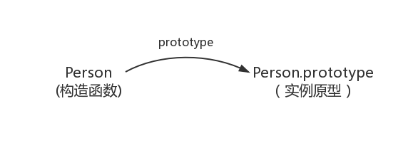
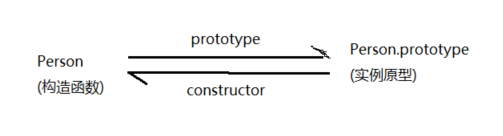
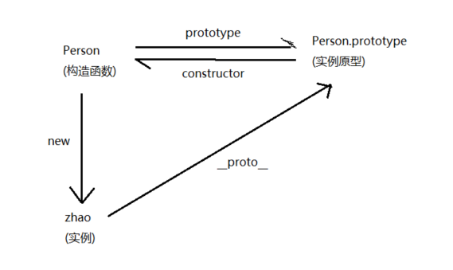
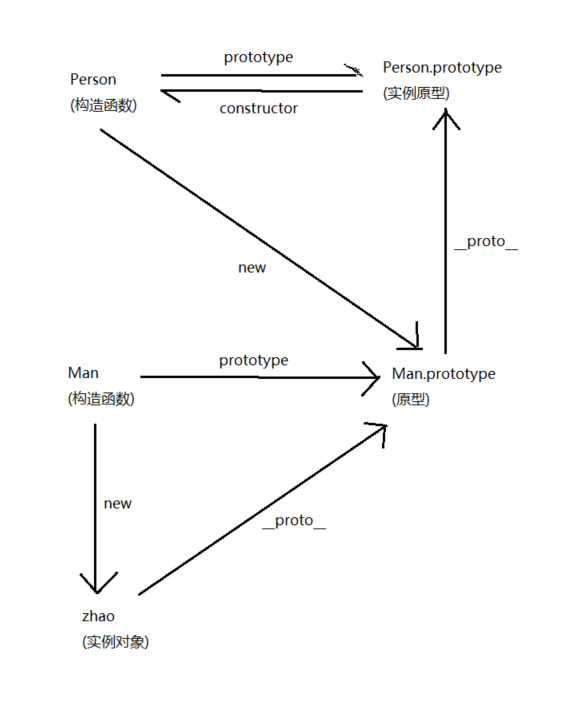

## JavaScript -- 原型和原型链

@(Interview)

原型和原型链，和闭包一样是一个很重要的知识点，今天来总结一下

### 前言

我们先来说一下为什么会有原型和原型链(下面这段看的阮一峰老师的博客)

#### 1. 当时的环境

 我们从`JavaScript`的创始说起，在`Brendan Eich`创始JS时，那个时候对于JS的需求只是一些简单的操作，比如判断用户有没有填写表单这样的。
 
与此同时，那个时候正是面向对象编程最兴盛的时期，C++是当时最流行的语言
 
`Brendan Eich`应该是受到了影响，`JavaScript`里所有的数据类型都是对象(object)，这一点和`Java`非常的相似。但是他当时遇到了一个问题，就是到底需不需要设计**继承**这个机制

#### 2. `Brendan Eich`选择

因为所要设计的语言是一种简易的脚本语言，其实是不需要有**继承**这样的机制的。但是，因为JS里面都是对象，必须有一种机制，将所有对象联系起来。所以，`Brendan Eich`最后还是设计了**继承**

但是，他并不打算引入**类**这个概念(尽管ES6有了类，也只不过是原型的语法糖)，因为一旦有了**类**，JS 就是一种完整的面向对象编程语言了，他觉得这样是没有必要的，而且这样还会增加初学者的入门难度。

他考虑到了 `C++` 和 `Java` 语言都使用了`new` 命令，生成实例

因此，他就把 `new` 命令引入了 `JavaScript`， 用来从原型对象生成一个实例对象。但是，JS 又没有**类**这个概念，通过什么来表示原型对象呢？

他又想到`C++`和`Java`使用`new`命令时，都会调用**类**的构造函数。他就做了一个简化的设计，在 JS 语言中，`new` 命令后面跟的不是**类**，而是**构造函数**

咱们举个例子，现在有一个叫做DOG的构造函数，表示**狗**对象的原型

```
　　function DOG(name){

　　　　this.name = name;

　　}
```
对这个构造函数使用`new`，就会生成一个**狗**对象的实例

```
　　var dogA = new DOG('大毛');

　　alert(dogA.name); // 大毛
```

#### 3. `new`运算符的缺点

用构造函数生成实例对象，有一个缺点，就是无法共享属性和方法

比如，在DOG对象的构造函数中，设置一个实例对象的共有属性`species`

```
　　function DOG(name){

　　　　this.name = name;

　　　　this.species = '犬科';

　　}
```
然后，生成两个实例对象

```
var dogA = new DOG('大毛')
var dogB = new DOG('二毛')
```
这两个对象的`species`属性是独立的，修改其中一个，不会影响到另一个。
```
dogA.species = '猫科';

alert(dogB.species); // 显示"犬科"，不受dogA的影响
```
每一个实例对象，都有自己的属性和方法的副本。这不仅无法做到数据共享，也是极大的资源浪费

重点来了~

#### 4. prototype属性的引入

因为相同的属性和方法，无法做到数据共享，因此他给**构造函数**设置了一个 `prototype` 属性

这个属性包含一个对象，所有实例对象需要共享的属性和方法，都放在这个对象里面，那些不需要共享的就放在自己的构造函数里面。

实例对象一旦创建，将自动引用`prototype`对象的属性和方法。也就是说，实例对象的属性和方法分为了本身构造函数的和原型对象上的。

**这就引出了原型，原型链一些列的问题，接下来我们来正式看一下~**

### 一丶原型

#### 1.理解

##### (1). prototype
我们先从原型讲起，什么是原型呢，用红宝书上的话来讲

> 无论什么时候，只要创建了一个新函数，就会根据一组特定的规则为该函数创建一个 `prototype` 属性，**这个属性指向函数的原型对象**

> 我们创建的每个函数都有一个`prototype`属性，这个属性是一个指针，指向一个对象，**而这个对象的用途是包含可以由特定类型的所有实例共享的属性和方法**

这里说的这个**指向的对象**就是原型

那么我们用`function.prototype`来表示原型对象(这里的`function`表示函数)

比如，我们写了一个构造函数

```
function Person () {
}

Person.prototype.name = 'Zhao';
```

这样我们就通过`Person`函数的`prototype`属性访问到了原型对象，那么之后`Person`的实例就可以从原型`Person.prototype`上**继承**属性或方法



用一张图表示，就是这样的

##### (2). constructor

那么对于每一个**原型对象**，也会有一个属性，这个属性是一个指向 `prototype` 属性所在函数的指针。**也就是指向关联该原型的构造函数的属性**

用上面的例子

```
function Person() {
}

console.log(Person.prototype.constructor === Person) // true
```

首先`prototype`取到`Person`的原型对象，然后找到该原型对象上的`constructor`属性，发现它指的是`Person`构造函数

创建了自定义的构造函数后，其原型对象上的属性只有`constructor`一个，至于其他的方法，都是从 `Object` 上继承而来的

现在我们用图来表示是这样的



##### (3). `__proto__`

那么构造函数有了，原型对象有了，我们该创建**实例**了。

我们调用构造函数创建一个实例

```
function Person() {
}

let zhao = new Person();
```

这里的`new`操作符也很有学问，专门会提处一篇博客讲`new`，这里不细说

那么这里创建的实例有没有办法联系到它对应的构造函数对应的原型对象呢？

当然有！

每个实例的内部包含一个指针，它是一个内部属性，指向了构造函数的原型对象。这个指针叫[[Prototype]]。

要访问这个指针，需要一个属性`__proto__`，这是在每个实例中都会有的一个属性。

通过这个属性可以连接**实例**与**构造函数对应的原型对象**

> **注意：这个 [[Prototype]] 指针是在实例创建的时候就已经确定的，如果在创建实例之后修改`Person.prototype`的指向，这个指针将不会改变**

```
function Person() {
}

let zhao = new Person();

console.log(zhao.__proto__ === Person.prototype) // true 
```

可以看到，两个是完全相同的，现在更新一下图



##### (5). 方法

介绍两种相关的方法，用来判断原型对象和实例之间的关系

**isPrototypeOf**

首先是`isPrototypeOf`方法，描述是这样的

> 从本质上讲，如果`[[Prototype]]`指向调用 `isPrototypeOf()`方法的对象，那么这个方法就返回`true`

还是上面的例子

```
function Person() {
}

let zhao = new Person();

console.log(Person.prototype.isPrototypeOf(zhao)]) // true
```

对象`zhao`的内部有一个`[[Prototype]]`指针指向`Person.prototype`，所以返回了`true`

**Object.getPrototypeOf**

还有一个`Object.getPrototypeOf`方法

> 这个方法返回`[[Prototype]]`的值

```
function Person() {
}

let zhao = new Person();

console.log(Person.prototype === Object.getPrototypeOf(zhao)) // true
```

使用这个方法可以方便的取得一个对象的原型

#### 2. 向原型上寻找

##### (1). 访问原型上的属性

**当读取实例的属性时，如果找不到，就会查找与对象关联的原型中的属性**

这正是多个对象实例共享原型所保存的属性和方法的基本原理
```
function Person(name) {
	this.name = name';
}

Person.prototype.age = 18;

let zhao = new Person('zhao');
let li = new Person('li');

console.log(zhao.name) // zhao
console.log(li.name) // li

console.log(zhao.age) // 18
console.log(li.age) // 18
```

我们可以看见，两个实例有各自的`name`属性，但是却有共同的`age`属性，正是因为我们把`age`放到了**原型**中

所以实际上，他们访问的`age`属性其实就是`zhao.__proto__.age`属性

##### (2). 可读不可改

虽然说我们通过**对象实例**可以访问到**原型对象**中的值，但是却**不能通过实例对象重写原型中的值。**

如果我们在实例中添加了一个属性，而该属性与实例原型中的一个属性同名，那我们就会在实例中创建该属性，该属性将会**屏蔽**原型中的属性。

```
function Person(name) {
	this.name = name;
}

Person.prototype.age = 18;

let zhao = new Person('zhao');
let li = new Person('li');

zhao.age = 20;

console.log(zhao.age) // 20 -- 来自实例
console.log(li.age) // 18 -- 来自原型
```
可以看到，在`zhao`上的`age`属性**屏蔽**了原型上的`age`属性，所以访问`zhao.age`只能访问到 20

如果在设置了实例属性后还是想访问原型对象上的方法，可以用`delete`操作符删除了实例属性

##### (3). hasOwnProperty

这里又有一个新方法`hasOwnProperty`

> 这个方法可以检测一个属性是存在于实例中，还是存在于原型中，只在给定属性存在于对象实例中时，才会返回`true`，否则返回`false`

```
function Person(name) {
	this.name = name;
}

Person.prototype.age = 18;

let zhao = new Person('zhao');
let li = new Person('li');

console.log(zhao.hasOwnProperty("name")) // true
console.log(zhao.hasOwnProperty("age")) // false
```
`age`属性是来自于原型的，所以返回`false`，`name`属性是实例上的属性，所以返回`true`


##### (4). 原型的原型

如果一个属性，在原型上也找不到该如何呢

它会继续找原型的原型

原型的原型是什么呢，我们把这个问题放一放，先来看看另一个名词

---

### 二丶原型链

#### 1. 理解

原型链是什么，先看一段代码

```
function Person () {
	this.name = 'zhao';
}

function Man () {
	this.age = 20;
}

Man.prototype = new Person();

let zhao = new Man();

console.log(zhao.name) // zhao  
```

我们声明了两个构造函数，并将`Man`的原型对象赋值为`Person`的实例

然后我们惊奇的发现，`Man`的实例竟然可以访问`Person`上的属性了！

讲道理~

在寻找`name`属性的时候，首先在`zhao`上寻找，发现并没有，于是向`zhao`的原型对象上找，也就是`Man.prototype`，但是`Man.prototype`被我们赋值为`Person`的实例，那就相当于，是在`Person`的实例上寻找`name`，这下就找到了。

那么如果不是两个构造函数，而是三个，四个呢。**这样层层的递进，就构成了实例与原型的链条。这就是所谓的原型链的概念**

看图~




我们从图上发现`Man.prototype`指向`Man`的`constructor`不见了，这是因为我们重写了`Man.prototype`，所以`constructor`不复存在

图上的一条条的`__proto__`和一个个的`prototype`构成了传说中的原型链，那么任意一个**属性**的寻找，都会顺着这条链条向上寻找，直到找到为止

那什么是个头呢，我们知道，所有的对象都是`Object`的实例，**所以最顶层的原型对象就是`Object.prototype`，再往上就是`null`了**

#### 2. 确定原型和实例的关系

在使用了原型链后，我们要如何判断原型和实例的这种继承关系呢，一般有两种方法

##### (1). instanceof

只要用这个操作符来测试实例与原型链中出现过的构造函数，结果就会返回`true`

```
function Person () {
	this.name = 'zhao';
}

function Man () {
	this.age = 20;
}

Man.prototype = new Person();

let zhao = new Man();

console.log(zhao instanceof Man) // true  
console.log(zhao instanceof Person) // true  
console.log(zhao instanceof Object) // true  
```

#### (2). isPrototypeOf

第二种方法就是`isPrototypeOf`

这种方法我们之前介绍过，那么只要是原型链中出现过的原型，都可以说是该原型链所派生的实例的原型，所以都会返回`true`

```
function Person () {
	this.name = 'zhao';
}

function Man () {
	this.age = 20;
}

Man.prototype = new Person();

let zhao = new Man();

console.log(Man.prototype.isPrototypeOf(zhao)) // true  
console.log(Person.prototype.isPrototypeOf(zhao)) // true  
console.log(Object.prototype.isPrototypeOf(zhao)) // true  
```

#### 3. 原型链存在的问题呢

原型链也并不是完美的，它包含了一些问题

**当原型链中包含了引用类型的原型时，该引用类型值会被所有实例共享**
```
function Person () {
	this.name = ['zhao', 'li', 'wang'];
}

function Man () {
	this.age = 20;
}

Man.prototype = new Person();

let zhao = new Man();
zhao.name.push('qian');

let li = new Man();
console.log(li.name) // ["zhao", "li", "wang", "qian"]
```

`Man`的所有实例共享了`name`属性，所以我们通过数组方法`push`修改了它，发现所有的`Man`实例都发生了修改

---

#####参考
- <a href="https://github.com/mqyqingfeng/Blog/issues/2">https://github.com/mqyqingfeng/Blog/issues/2</a>
- <a href="http://www.ruanyifeng.com/blog/2011/06/designing_ideas_of_inheritance_mechanism_in_javascript.html">http://www.ruanyifeng.com/blog/2011/06/designing_ideas_of_inheritance_mechanism_in_javascript.html</a>

---
