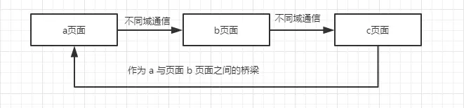

## JavaScript -- 跨域

@(Interview)

跨域，说到跨域，我们得聊聊跨的是个什么域

### 一丶同源策略

同源策略是浏览器上为**安全性考虑**实施的非常重要的**安全策略**

同源：如果两个`URL`的**协议**，**域名**，**端口**相同，则表示他们同源

同源策略限制了从同一个源加载的文档或脚本与来自另一个源的资源进行交互。这是一个用于隔离潜在恶意文件的重要安全机制。

同源政策的目的，是为了**保证用户信息的安全，防止恶意的网站窃取数据**。

如果非同源，会有三种行为受到限制
- `Cookie`，`LocalStorage`和`IndexDB`无法读取
- `DOM`无法获得
- `AJAX`请求不能发送


接下来我们要解决这三种限制

### 二丶跨域

有很多跨域的方法，不同的跨域方法解决了不同的问题

#### 1. document.domain + iframe

在讲这个方法之前，有一点需要说明，**这个方案只限于主域相同子域不同的资源跨域解决方案**

**如何使用：**

首先，假设现在有一个页面，它的地址是`www.damonare.cn/a.html`，在这个页面里面有一个`iframe`，它的`src`是`damonare.cn/b.html`，很显然这个页面与它里面的`iframe`框架是不同域的，所以我们是无法通过在页面中书写 JS 代码来获取`iframe`的东西的。看下代码：

**HTML内容**
```
<iframe id = "iframe" src="http://damonare.cn/b.html" onload = "test()"></iframe>
```
**JS代码**
```
function test () {
	var iframe = document.getElementById('iframe');
    var win = iframe.contentWindow; //可以获取到iframe里的window对象，但该window对象的属性和方法几乎是不可用的
    var doc = win.document; //这里获取不到iframe里的document对象
    var name = win.name; //这里同样获取不到window对象的name属性
}
```
如果想要访问`window`对象的属性和方法，就需要用到`document.domain`了

我们需要做的就是将这两个页面的`document.domain`设置成**相同的域名**就行了，但是要注意的是，`document.domain`的设置是有限制的，我们只能把`document.domain`设置成自身或更高一级的父域，且主域必须相同。

在两个页面中如下设置：
```
document.domain = 'document.cn';
```

这样就可以通过`window`对象访问到需要的属性了

通过这个方法，我们能解决上面两种问题：
- 首先可以获取到`DOM`
- 可以解决Cookie跨域问题


#### 2. window.name + iframe

这个方法是借助了`window.name`的原理

`window.name`指的是当前**浏览器窗口的名称**，默认为空字符串，每个窗口的`window.name`都是独立的。它的独特之处在于当在页面设置了`window.name`的值时，其实就是**相当于给这个窗口设置了名称**，而后在这个窗口加载其他页面（甚至不同域的页面），`window.name` 的值**依然存在**（如果没有重新设置那么值不会变化）。

如果根据这个原理，我们再加上`iframe`就可以得到一个很神奇的操作

首先，页面中嵌套`iframe`时，`iframe`中的页面也会有自己的`window.name`，而且是独一无二的，那么我们就可以利用这一点，获取`iframe`中的`window.name`

假设有两个页面`http://localhost:8080/a.html`和`http://localhost:8081/b.html`。我们要进行这两个页面的跨域通信。

首先，在`b.html`中设置一个跨域所要取得的信息
```
// b.html
window.name = 'zhao';
```

然后我们在`a.html`通过`iframe`嵌套`b.html`，在`a.html`中写如下代码：
```
var state = 0;
var iframe = document.getElementById('iframe');
iframe.onload = function() {
	if (state === 0) {
	    iframe.src = 'http://localhost:8080/c.html';
    	state = 1;
	} else if (state === 1) {
		data = iframe.contentWindow.name;
	    console.log('收到数据:', data);
	}
}
```
在`iframe`加载完成后，立马让他跳转为和`a.html`同域下的页面`http://localhost:8080/c.html`，这样就可以获取`b.html`的属性值了

相较于`document.domain`，`window.name`有以下几点优点：
- 可以跨主域不同的网页
- `window.name`的值支持比较大的存储

缺点是：必须监听子窗口`window.name`属性的变化，影响网页性能

通过这个方法可以解决上面两种问题：
- 首先可以获取到`DOM`
- 可以解决Cookie跨域问题

#### 3. location.hash + iframe

这个方法的原理是这样，因为父窗口可以对`iframe`进行`URL`读写，`iframe`也可以读写父窗口的`URL`，`URL`有一部分被称为`hash`，就是`#`号及其后面的字符，它一般用于浏览器锚点定位，`Server`端并不关心这部分，应该说**`HTTP`请求过程中不会携带`hash`**，所以这部分的修改不会产生`HTTP`请求，但是会产生浏览器历史记录。此方法的原理就是**改变`URL`的`hash`部分来进行双向通信**。每个`window`通过改变其他 `window`的`location`来发送消息

**具体步骤如下：**

- 不同域的 a 页面与 b 页面进行通信，在 a 页面中通过 `iframe` 嵌入 b 页面，并给 `iframe `的 `src` 添加一个 `hash` 值。
- b 页面接收到了 `hash` 值后，确定 a 页面在尝试着与自己通信，然后通过修改 `parent.location.hash` 的值，将要通信的数据传递给 a 页面的 `hash` 值。
- 但由于在 IE 和 Chrome 下不允许**不在同一个域下**子页面直接修改父页面的 `hash` 值，所以需要一个代理页面，通过与 a 页面同域的 c 页面来传递数据。
- 同样的在 b 页面中通过 `iframe` 嵌入 c 页面，将要传递的数据通过  `iframe` 的 `src` 链接的 `hash` 值传递给 c 页面，由于 a 页面与 c 页面同域，c 页面可以直接修改 a 页面的 `hash` 值或者调用 a 页面中的全局函数。

用一张图表示如下



a 页面代码：
```
	var iframe = document.createElement('iframe');
    iframe.style.display = 'none';
    iframe.src = "http://localhost:8081/b.html#data";
    document.body.appendChild(iframe);

    function checkHash() {
        try {
            var data = location.hash ? location.hash.substring(1) : '';
            console.log('获得到的数据是：', data);
        }catch(e) {}
    }
    window.addEventListener('hashchange', function(e) {
        console.log('监听到hash的变化：', location.hash.substring(1));
    })
```

b 页面代码：
```
	switch(location.hash) {
         case '#data':
         callback();
         break;
    }
    function callback() {
        var data = "testHash"
        try {
            parent.location.hash = data;
        }catch(e) {
            var ifrproxy = document.createElement('iframe');
            ifrproxy.style.display = 'none';
            ifrproxy.src = 'http://localhost:8080/c.html#' + data;
            document.body.appendChild(ifrproxy);
        }
    }
```

c 页面代码：
```
	// 修改 a 页面的 hash 值
    parent.parent.location.hash = self.location.hash.substring(1);
    // 调用 a 页面的全局函数
    parent.parent.checkHash();
```

这种方法有如下缺点：
- `hash`传递的数据容量有限
- 数据直接暴露在`url`中

这种方法可以解决上面两种问题
- 首先可以获取到`DOM`
- 可以解决Cookie跨域问题

#### 4. window.postMessage + iframe

上面的方法都属于破解，而`HTML5`为了解决这个问题，引入了一个全新的`API`，跨文档通信API。这个API为`window`对象新增了一个`window.postMessage`方法，允许跨窗口通信，不论这两个窗口是否同源。

举个简单的例子：
父窗口`http://aaa.com`向子窗口`http://bbb.com`发消息，调用`postMesssage`方法就可以了

`postMessage`的使用方法：
> `otherWindow.postMessage(message, targetOrigin);`

- `otherWindow`：指定目标窗口，也就是给哪个`window`发消息，是`window.frames`属性的成员或者由`window.open`方法创建的窗口
- `message`：需要传递的参数
- `targetOrigin`：数据传递的目标窗口域名，值可以是具体的域名或者`*`通配符

A 页面通过`postMessage`方法发送消息：
```
window.onload = function() {  
    var ifr = document.getElementById('ifr');  
    var targetOrigin = "*";  
    ifr.contentWindow.postMessage('hello world!', targetOrigin);  
};
```

B 页面通过`message`事件监听并接受消息
```
var targetOrigin = 'http://aaa.com';
window.addEventListener('message', function(e) {
	if(e.source != window.parent) {
		return;
	}
	// 接收 a.html 发送的数据
	console.log('a.html 发送来的消息:', e.data);
	// 向 a.html 发送消息
	event.source.postMessage('哈哈，我是b页面，我收到你的消息了', targetOrigin);
})
```
这里的`message`事件的事件对象有以下三个属性：

- `event.source`：发送消息的窗口
- `event.origin`：发送消息的网址
- `event.data`：消息内容

这种方法可以解决上面两种问题
- 首先可以获取到`DOM`
- 可以解决Cookie跨域问题

---

以上我们说到的四种方式，都是为了解决**窗口页面之间的数据通信**，接下来的三种方式是为了解决**前后端之间的数据通信**，接下来的才是重点~

---

#### 5. CORS

###### (1). 简介

CORS 是 `W3C` 颁布的一个浏览器技术规范，其全称为 "跨域资源共享"，它的意义在于，它是由`W3C` 官方推广的允许通过 `AJAX` 技术跨域获取资源的规范，

CORS 需要浏览器和服务器同时支持。目前，所有浏览器都支持该功能，`IE`浏览器不能低于`IE10`

整个`CORS`通信过程，都是浏览器**自动完成**，不需要用户参与。对于开发者来说，`CORS`通信与同源的`AJAX`通信没有差别，代码完全一样。浏览器一旦发现`AJAX`请求跨源，就会自动添加一些附加的头信息，有时候还会多处一次附加的请求，但是用户不会有感觉。

因此，实现`CORS`通信的关键是服务器。只要服务器实现了`CORS`接口，就可以跨源通信

##### (2). 两种请求

浏览器将`CORS`请求分为两类：**简单请求**和**非简单请求**。

只要同时满足以下两大条件，就属于简单请求

> (1). 请求方法是以下三种方法之一：
> - HEAD
> - GET
> - POST
> 
> (2). HTTP的头信息不超出以下几种字段：
> - Accept
> - Accept-Language
> - Content-Language
> - Last-Event-ID
> - Content-Type：只限于三个值application/x-www-form-urlencoded、multipart/form-data、text/plain

凡是不同时满足上面两个条件，就属于非简单请求

浏览器对这两种请求的处理是不一样的


##### (3). 简单请求

##### 基本流程

对于简单请求，浏览器直接发出`CORS`请求。具体来说，就是在头信息之中，增加一个`Origin`字段。

下面是一个例子，浏览器发现这次跨源 `AJAX` 请求时简单请求，就自动在头信息之中，添加一个`Origin`字段。

```
GET /cors HTTP/1.1
Origin: http://api.bob.com
Host: api.alice.com
Accept-Language: en-US
Connection: keep-alive
User-Agent: Mozilla/5.0...
```
上面的头信息中，`Origin`字段用来说明，本次请求来自哪个源（协议 + 域名 + 端口）。服务器根据这个值，决定是否同意这次请求。

如果 `Origin` 指定的源，不在许可范围内，服务器会返回一个正常的 `HTTP` 回应。浏览器发现，这个回应的头信息没有包含`Access-Control-Allow-Origin`字段，就知道出错了，从而抛出一个错误，被 `XMLHttpRequest` 的 `onerror` 回调函数捕获。

**注意，这种错误无法通过状态吗识别，因为 `HTTP` 回应的状态码有可能是 200，说明服务器已经执行了你的请求，只不过在信息返回的时候会被浏览器拦截**

如果 `Origin` 指定的域名在许可范围内，服务器返回的响应，会多出几个头信息字段

```
Access-Control-Allow-Origin: http://api.bob.com
Access-Control-Allow-Credentials: true
Access-Control-Expose-Headers: FooBar
Content-Type: text/html; charset=utf-8
```
上面的头信息之中，有三个与`CORS`请求相关的字段，都以`Access-Control-`开头。

**(1). Access-Control-Allow-Origin**

该字段是必须的。它的值要么是请求时`Origin`字段的值，要么是一个`*`，表示接受任意域名的请求。

**(2). Access-Control-Allow-Credentials**

该字段可选。它的值是一个布尔值，表示是否允许发送Cookie。默认情况下，Cookie不包括在CORS请求之中。设为true，即表示服务器明确许可，Cookie可以包含在请求中，一起发给服务器。这个值也只能设为true，如果服务器不要浏览器发送Cookie，删除该字段即可。

**(3). Access-Control-Expose-Headers**

该字段可选。`CORS`请求时，`XMLHttpRequest` 对象的` getResponseHeader()` 方法只能拿到6个基本字段：Cache-Control、Content-Language、Content-Type、Expires、Last-Modified、Pragma。如果想拿到其他字段，就必须在Access-Control-Expose-Headers里面指定。上面的例子指定，getResponseHeader('FooBar')可以返回FooBar字段的值。

**withCredentials 属性**

上面说到，`CORS`请求默认不发送 `Cookie` 和 `HTTP` 认证信息。如果要把 `Cookie` 发到服务器，一方面要服务器同意，指定 `Access-Control-Allow-Credentials` 字段。

```
Access-Control-Allow-Credentials: true
```
另一方面，开发者必须在 AJAX 请求中打开 `withCredentials` 属性
```
var xhr = new XMLHttpRequest();
xhr.withCredentials = true;
```
否则，即使服务器同意发送Cookie，浏览器也不会发送。或者，服务器要求设置Cookie，浏览器也不会处理。

**但是，如果省略withCredentials设置，有的浏览器还是会一起发送Cookie。这时，可以显式关闭withCredentials。**

```
xhr.withCredentials = false;
```

需要注意的是，**如果要发送`Cookie`，`Access-Control-Allow-Origin`就不能设为星号，必须指定明确的、与请求网页一致的域名**。同时，`Cookie` 依然遵循同源政策，只有用服务器域名设置的 `Cookie` 才会上传，其他域名的 `Cookie` 并不会上传，且（跨源）原网页代码中的`document.cookie` 也无法读取服务器域名下的 `Cookie`。

##### (4). 非简单请求

非简单请求是那种对服务器有特殊要求的请求，比如请求方法是`PUT`或`DELETE`，或者`Content-Type`字段的类型是`application/json`。

非简单请求的`CORS`请求，会在正式通信之前，增加一次`HTTP`查询请求，称为"预检"请求。

**如果预检请求不通过，服务器是不可能执行你的正式请求的**

浏览器先询问服务器，当前网页所在的域名是否在服务器的许可名单之中，以及可以使用哪些`HTTP`动词和头信息字段。只有得到肯定答复，浏览器才会发出正式的`XMLHttpRequest`请求，否则就报错。

下面是一段浏览器的 `JavaScript` 脚本。

```
var url = 'http://api.alice.com/cors';
var xhr = new XMLHttpRequest();
xhr.open('PUT', url, true);
xhr.setRequestHeader('X-Custom-Header', 'value');
xhr.send();
```

上面代码中，HTTP请求的方法是`PUT`，并且发送一个自定义头信息`X-Custom-Header`。

浏览器发现，这是一个非简单请求，就自动发出一个"预检"请求，要求服务器确认可以这样请求。下面是这个"预检"请求的HTTP头信息。
```
OPTIONS /cors HTTP/1.1
Origin: http://api.bob.com
Access-Control-Request-Method: PUT
Access-Control-Request-Headers: X-Custom-Header
Host: api.alice.com
Accept-Language: en-US
Connection: keep-alive
User-Agent: Mozilla/5.0...
```

"预检"请求用的请求方法是`OPTIONS`，表示这个请求是用来询问的。头信息里面，关键字段是`Origin`，表示请求来自哪个源。

除了`Origin`字段，"预检"请求的头信息包括两个特殊字段。

**(1). Access-Control-Request-Method**

该字段是必须的，用来列出浏览器的CORS请求会用到哪些HTTP方法，上例是`PUT`。

**(2). Access-Control-Request-Headers**

该字段是一个逗号分隔的字符串，指定浏览器CORS请求会额外发送的头信息字段，上例是`X-Custom-Header`。


**预检请求的回应**

服务器收到”预检“请求以后，检查了 `Origin`，`Access-Control-Request-Method` 和 `Access-Control-Request-Headers` 字段以后，确认允许跨域请求，就可以做出回应

```
HTTP/1.1 200 OK
Date: Mon, 01 Dec 2008 01:15:39 GMT
Server: Apache/2.0.61 (Unix)
Access-Control-Allow-Origin: http://api.bob.com
Access-Control-Allow-Methods: GET, POST, PUT
Access-Control-Allow-Headers: X-Custom-Header
Content-Type: text/html; charset=utf-8
Content-Encoding: gzip
Content-Length: 0
Keep-Alive: timeout=2, max=100
Connection: Keep-Alive
Content-Type: text/plain
```

上面的 HTTP 回应中，关键是 `Access-Control-Allow-Origin` 字段，表示 `https://api.bob.com` 可以请求数据。该字段也可以设置为星号，表示同意任意跨源请求

```
Access-Control-Allow-Origin: *
```

如果浏览器否定了"预检"请求，会返回一个正常的HTTP回应，但是没有任何CORS相关的头信息字段。这时，浏览器就会认定，服务器不同意预检请求，因此触发一个错误，被`XMLHttpRequest`对象的`onerror`回调函数捕获。控制台会打印出如下的报错信息。

```
XMLHttpRequest cannot load http://api.alice.com.
Origin http://api.bob.com is not allowed by Access-Control-Allow-Origin.
```
服务器回应的其他CORS相关字段如下。

```
Access-Control-Allow-Methods: GET, POST, PUT
Access-Control-Allow-Headers: X-Custom-Header
Access-Control-Allow-Credentials: true
Access-Control-Max-Age: 1728000
```

（1）Access-Control-Allow-Methods

该字段必需，它的值是逗号分隔的一个字符串，表明服务器支持的所有跨域请求的方法。注意，返回的是所有支持的方法，而不单是浏览器请求的那个方法。这是为了避免多次"预检"请求。

（2）Access-Control-Allow-Headers

如果浏览器请求包括Access-Control-Request-Headers字段，则Access-Control-Allow-Headers字段是必需的。它也是一个逗号分隔的字符串，表明服务器支持的所有头信息字段，不限于浏览器在"预检"中请求的字段。

（3）Access-Control-Allow-Credentials

该字段与简单请求时的含义相同。

（4）Access-Control-Max-Age

该字段可选，用来指定本次预检请求的有效期，单位为秒。上面结果中，有效期是20天（1728000秒），即允许缓存该条回应1728000秒（即20天），在此期间，不用发出另一条预检请求。

**浏览器的正常请求和回应**

一旦服务器通过了"预检"请求，以后每次浏览器正常的CORS请求，就都跟简单请求一样，会有一个 `Origin` 头信息字段。服务器的回应，也都会有一个 `Access-Control-Allow-Origin` 头信息字段。

下面是"预检"请求之后，浏览器的正常CORS请求。

```
PUT /cors HTTP/1.1
Origin: http://api.bob.com
Host: api.alice.com
X-Custom-Header: value
Accept-Language: en-US
Connection: keep-alive
User-Agent: Mozilla/5.0...
```

上面头信息的 `Origin` 字段是浏览器自动添加的。

下面是服务器正常的回应。

```
Access-Control-Allow-Origin: http://api.bob.com
Content-Type: text/html; charset=utf-8
```

上面头信息中，`Access-Control-Allow-Origin` 字段是每次回应都必定包含的。

##### (5). 与JSONP的比较

CORS与JSONP的使用目的相同，但是比JSONP更强大。

JSONP只支持`GET`请求，CORS支持所有类型的HTTP请求。JSONP的优势在于支持老式浏览器，以及可以向不支持CORS的网站请求数据。

##### (6). CORS优缺点

优点：
- 首先CORS支持多种方式
- CORS符合规范，因为是官方定义的

缺点：
- 相较于 JSONP 来说，CORS的兼容性不是很好，不支持`IE8`以下的版本

#### 6. JSONP

JSONP 是一个野路子出身，却异常好用的方法。

对于**同源策略**有这样一个算是漏洞也不算是漏洞的规则：**同源策略只是阻止了通过AJAX技术跨域获取资源，而并没有禁止跨域获取资源这件事本身**，正因为如此，我们可以通过`<link>`标签和``标签以及`<script>`标签中的`href`属性或`src`属性获取非同源的CSS，JS资源和图片。

我们就是利用这一点，`<script>`标签通过`src`属性加载的JS资源，实际上只是将JS文件内容原封不动的放置在`<scritp>`的标签内

也就是说，如果我们的`sayHi.js`文件只有这样一句话

```
// sayHi.js
alert('Hi');
```

当我们在HTML文件中，成功加载`sayHi.js`文件时，浏览器只不过是做了如下的操作：

```
<!-- 加载前 -->
<script src="sayHi.js"></script>

<!-- 加载后 （为了方便阅读，我格式化了代码）-->
<script src="sayHi.js">
    alert('Hi')
</script>
```

这意味着什么呢？这意味着被加载的文件与HTML文件下的其他JS文件共享一个全局作用域。也就是说，`<scritp>`标签加载到的资源是可以被全局作用域下的函数所使用的！

所以我们的JSONP就这样诞生了，我们已经约定好了数据的格式为 JSON，这是`JavaScript` 可以处理的数据类型，并且 JSON 格式的数据可以承载大量信息，那么有关**变量**的问题怎么办，这个回答更巧妙些，因为我们会通过向服务器传入一个**函数的方式**，将数据变为函数的参数，让我们直接看看JSONP的使用方式：

```
function handleResponse(response) {
	alert(`you get the data : ${response}`);
}
const script = document.createElement('script');
script.src = 'http://somesite.com/json/?callback=handleResponse'
document.body.insertBefore(script, document.body.firstChild);
```

很容易看到，我们在1-3行中创建了一个函数，该函数用来处理我们将要获得的数据，该函数的参数 `response` 即是服务器响应的数据。在4-6行中我们所做的是利用 JavaScript 动态生成一个`script` 标签，并将其插入HTML文档。但是注意第5行我们制定的 `src` 值，在URL末尾，我们有这样一段查询参数 `callback=handleResponse`，`callback` 的值正是我们先前创建的函数。
事情开始变得有些令人困惑了，究竟发生了什么呢？我们如何通过上述代码最终实现跨域获取资源？

答案就藏在服务端的代码中，当服务端支持 JSONP 技术时，会做如下一些设置：

1. 识别请求的URL，提取`callback`参数的值，并动态生成一个执行该参数值（一个函数）的JavaScript语句；
2. 将需要返回的数据放入动态生成的函数中，等待其加在到页面时被执行；

此时该文件内容看起来就像这样：

```
handleResponse(response) // response为被请求的JSON格式的数据
```

因此，当资源加载到位，内容显示在 `script` 标签内时，浏览器引擎会执行这条语句，我们想要的数据就可以被我们以任何想要的方式处理了。

最后我们还需要对JSONP技术再强调一点：

> JSONP技术与AJAX技术无关：虽然同样牵扯到跨域获取资源这个主题，但我们应该已经清楚的看到，JSONP的本质是绕过AJAX获取资源的机制，使用原始的`src`属性获取异域资源；

JSONP的优点如下：

1. 兼容性很好
2. 不受同源策略的影响

JSONP的缺点如下：

1. JSONP只能发送`GET`请求。它只能用来请求数据，而不能发送数据或上传数据
2. 无法检测JSONP请求是否失败
3. JSONP 存在安全隐患，因为不论传回来的包含什么操作，浏览器都会执行操作，那么如果服务器下有添加恶意的JS代码就会很危险了

##### 实现JSONP 

```
(function (global) {
    var id = 0,
        container = document.getElementsByTagName("head")[0];

    function jsonp(options) {
        if(!options || !options.url) return;

        var scriptNode = document.createElement("script"),
            data = options.data || {},
            url = options.url,
            callback = options.callback,
            fnName = "jsonp" + id++;

        // 添加回调函数
        data["callback"] = fnName;

        // 拼接url
        var params = [];
        for (var key in data) {
            params.push(encodeURIComponent(key) + "=" + encodeURIComponent(data[key]));
        }
        url = url.indexOf("?") > 0 ? (url + "&") : (url + "?");
        url += params.join("&");
        scriptNode.src = url;

        // 传递的是一个匿名的回调函数，要执行的话，暴露为一个全局方法
        global[fnName] = function (ret) {
            callback && callback(ret);
            container.removeChild(scriptNode);
            delete global[fnName];
        }

        // 出错处理
        scriptNode.onerror = function () {
            callback && callback({error:"error"});
            container.removeChild(scriptNode);
            global[fnName] && delete global[fnName];
        }

        scriptNode.type = "text/javascript";
        container.appendChild(scriptNode)
    }

    global.jsonp = jsonp;

})(this);
```
然后我们就可以像下面这样使用示例了
```
jsonp({
    url : "www.example.com",
    data : {id : 1},
    callback : function (ret) {
        console.log(ret);
    }
});
```

#### 7. WebSocket


---

##### 参考：
- <a href="https://juejin.im/post/5815f4abbf22ec006893b431#heading-8">https://juejin.im/post/5815f4abbf22ec006893b431#heading-8</a>
- <a href="https://juejin.im/post/5a274ae9f265da430a5071eb">https://juejin.im/post/5a274ae9f265da430a5071eb</a>
- <a href="https://juejin.im/post/5b91d3be5188255c95380b5e">https://juejin.im/post/5b91d3be5188255c95380b5e</a>
- <a href="https://segmentfault.com/a/1190000007665361">https://segmentfault.com/a/1190000007665361</a>

---
