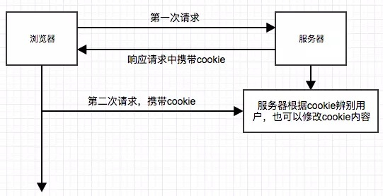
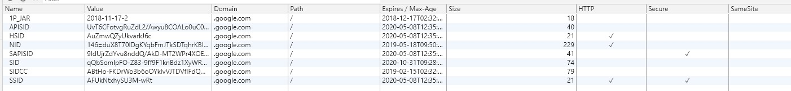
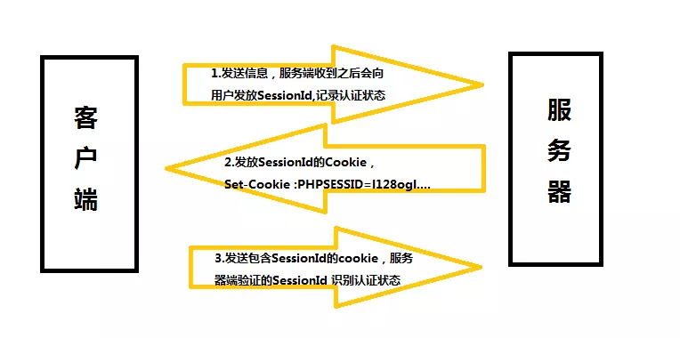

## 计算机网络 -- Cookie & Session

@(Interview)

`cookie`和`session`是必须掌握的，写篇博客研究一下

### 一丶Cookie

#### 1. 为什么会出现Cookie

对于`cookie`的出现，我们还是需要先说一下`Http`这个协议

`HTTP`他是一个无状态协议，什么叫无状态呢，就是在通过`HTTP`取请求数据的时候，服务器不清楚是不是同一个浏览器在访问他，因为`HTTP`本身是不保存任何用户的状态信息的。

那为了让服务器能够清楚是否是同一个浏览器在访问他，我们需要一个方法去保存用户的信息，这个时候`Cookie`就应运而生了

#### 2. 什么是Cookie

Cookie 实际上是一小段的文本信息，它负责浏览器管理状态，是由服务器发送给客户端的小量信息，以`{key: value}`的形式存在

#### 3. Cookie的原理

客户端请求服务器，如果服务器需要记录该用户状态，就使用`response`向客户端浏览器颁发一个 Cookie 。客户端会把 Cookie 保存起来。当浏览器再请求该网站时，**浏览器把请求的网址连同该 Cookie 一同提交给服务器**。服务器通过对比记录检查 Cookie ，以此来辨认用户状态。服务器还可以根据需要修改 Cookie 的内容。

原理总结下来就是这三步：
1. 客户端先请求服务器，如果需要记录状态，则由后端给前端发送一个 Cookie。
2. 客户端将 Cookie 保存起来。
3. 客户端再次请求服务器，将储存的 Cookie 携带。
4. 服务器根据 Cookie ，通过**对比服务器的记录**来辨别用户。服务器也可以修改 Cookie 内容

#### 4. Cookie的不可跨域性

Cookie 的不可跨域是因为同源策略，所以如果不同源（协议，域名，端口不同），请求是不会携带 Cookie 的。

打个比方，A网站 会向客户端颁发 Cookie A，B网站会向客户端颁发 Cookie B。那浏览器访问 A网站 是肯定不会携带上 B网站 颁发的 Cookie B。

**那如果在 B网站中有 A网站的连接，并且从B网站访问 A网站 也是会携带 Cookie A的**

#### 5. Cookie的属性

Cookie 的属性众多，我们可以打开`https://www.google.com`然后打开开发者工具，选择`Application`，就可以看到 Cookie 了。

我们来一个一个分析

##### (1). name

 顾名思义，这个就是 Cookie 的名称，**一个域名下绑定的 Cookie，`name`是不能相同的**，相同 `name` 的值会被覆盖掉，修改 Cookie 就是通过这个方法
 
##### (2). value

这个就是每个 Cookie 拥有的一个属性，它表示 Cookie 的值，对于 Cookie 的值，有两种说法：

1. Cookie 的值必须被 URL 编码
2. 对 Cookie 的值进行编码不是必须的，还举了原始文档中所说的，仅对**三种符号**进行编码，分号，逗号和空格

这两种其实都可以，但是最好还是都编码了，有这样一种说法
> 由于cookie规定是名称/值是不允许包含分号，逗号，空格的，所以为了不给用户到来麻烦，考虑服务器的兼容性，任何存储cookie的数据都应该被编码。

##### (3). domain

这个指的是域名，这个代表的是，Cookie绑定的域名，如果没有设置，就会自动绑定到执行语句的当前域，通过`domain`属性指定的域名可以做到**与结尾匹配一致**。比如，指定 `domain`是 `zzy.com`，除了`zzy.com`那么`www.zzy.com`和`me.zzy.com`都可以发送 Cookie

##### (4). path

`path`这个属性默认是 `/`，这个值匹配的是`web`的路由，举个例子
> // 默认路径
> www.baidu.com
> // blog路径
> www.baidu.com/blog
当你路径设置成 `/blog` 的时候，其实它会给 `/blog`，`/blogabc`等等的绑定 Cookie

##### (5). expires

这个属性代表的是 Cookie 的有效期，一般浏览器的 Cookie 都是默认储存的，当关闭浏览器结束这个会话的时候，这个 Cookie 也就会被删除。

如果想要 Cookie 存在一段时间，就可以通过设置 `expiress` 属性为未来的一个时间节点，`expiress` 这个是代表当前时间的。

不过这个属性已经逐渐被我们下面这个主人公所取代——`Max-Age`

##### (6). Max-Age

这个属性是以秒为单位，`Max-Age`为**正数**时，Cookie 会在 `Max-Age` 秒之后被删除。
当 `Max-Age` 为**负数**时，表示的是**临时储存**，不会生出 Cookie 文件，只会存在浏览器内存中，且只会在打开浏览器窗口或者子窗口有效，一旦浏览器关闭，Cookie 就会消失。
当 `Max-Age` 为 **0** 时，又会发生什么呢，会**删除 Cookie**，因为 Cookie 机制本身是没有设置删除 Cookie 这个功能，所以失效的 Cookie 会被浏览器自动从内存中删除，所以让 Cookie 失效就可以删除它

##### (7). secure

这个属性译为安全，HTTP 不仅是无状态的，还是不安全的协议，容易被劫持。当设置这个属性为 true 时，**此 Cookie 只会在 HTTPS 和 SSL 等安全协议下传输**

##### (8). HttpOnly

这个属性使 JS 脚本无法读写 Cookie。
JavaScript 是可以对 Cookie 进行读写操作的，但如果我们给 Cookie 添加这个属性后，JS 就无法读写 Cookie 

#### 6. Cookie的问题

Cookie 很完美解决了 HTTP 无状态所造成的问题，但是依旧存在一些问题呢

1. **Cookie 数量和长度的限制**。每个 `domain` 最多只能有20条 cookie（IE6或更低版本最多20个cookie，IE7及之后可以有50个cookie，firefox最多50个cookie），每个 cookie 长度不能超过4KB，否则会被截掉。
2. **安全性问题**。由于 Cookie 是保存在客户端的，所以很容易被人篡改，造成比较大的危害。
3. **有些状态不可能保存在客户端**。例如，为了防止重复提交表单，我们需要在服务器端保存一个计数器。如果我们把这个计数器保存在客户端，那么它起不到任何作用。
4. **Cookie不可跨域**

为了解决这些问题，就有了 Session

---

### 二丶Session

#### 1. 为什么会有 Session

因为 Cookie 是保存在客户端，有极大的安全性问题，并且 Cookie 的数量和长度也有很大限制，为了解决 Cookie 存在的一些问题，就出现了 Session

#### 2. 什么是 Session

Session 是另一种记录客户状态的机制，**不同的是 Cookie 保存在客户端浏览器中，而 Session 保存在服务器上**。客户端浏览器访问服务器的时候，服务器把客户端信息以某种形式记录在服务器上。这就是Session。客户端浏览器再次访问时只需要从该 Session 中查找该客户的状态就可以了。

如果说 Cookie 机制是通过检查客户身上的“通行证”来确定客户身份的话，那么 Session 机制就是通过检查服务器上的“客户明细表”来确认客户身份。Session 相当于程序在服务器上建立的一份客户档案，客户来访的时候只需要查询客户档案表就可以了。

#### 3. Session的原理

**步骤一：**客户端把信息放入报文的实体部分，通常是以 POST 方法把请求发送给服务器。
**步骤二：**服务器会发放用以识别用户的 **Session ID**。通过验证从客户端发送过来的信息进行验证，然后把用户的认证状态与 **Session ID** 绑定后**记录在服务器端**。向客户端反回响应时，会将包含了 Session ID 的 Cookie 返回。**Session ID 就像是区分不同用户的唯一Id**。
**步骤三：**客户端接收到从服务器端发来的Session ID 后，会将其作为 Cookie 保存在本地。下次向服务器发送请求时，浏览器会自动发送Cookie，所以 Session ID 也随之发送到服务器。服务器端可通过验证接收到的 Session ID 验证状态。

#### 4. Session的问题

Session 解决了 Cookie 存在的一些问题，但是也有自己的问题

1. 因为Session 是保存在服务器上的，所以如果保存的数据量过大会导致性能问题，甚至会直接导致服务器无法正常运行
2. Session的使用需要 Cookie ，所以在 Cookie 无法使用的时候
3. 对于后台来说，存在集群服务器的问题，在服务器 1 颁发的Session ID 在 服务器 2 是访问不到的

---

---

##### 参考：
- <a href="https://juejin.im/post/59d1f59bf265da06700b0934">https://juejin.im/post/59d1f59bf265da06700b0934</a>
- <a href="https://juejin.im/post/5aa783b76fb9a028d663d70a">https://juejin.im/post/5aa783b76fb9a028d663d70a</a>
- <a href="https://juejin.im/post/5aede266f265da0ba266e0ef">https://juejin.im/post/5aede266f265da0ba266e0ef</a>
- <a href="https://www.cnblogs.com/andy-zhou/p/5360107.html#_caption_1">https://www.cnblogs.com/andy-zhou/p/5360107.html#_caption_1</a>

---
